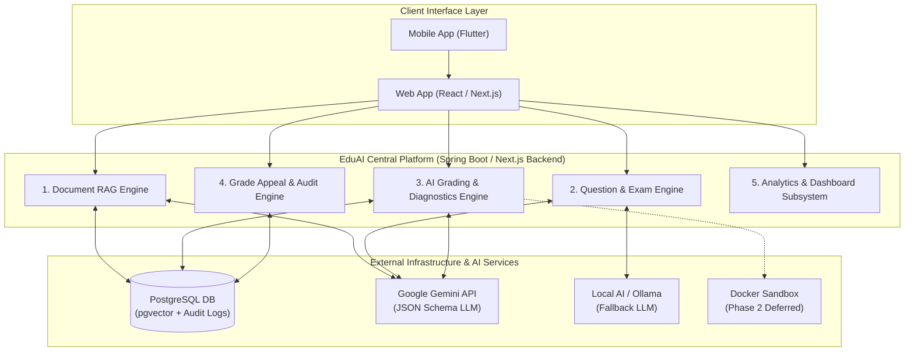
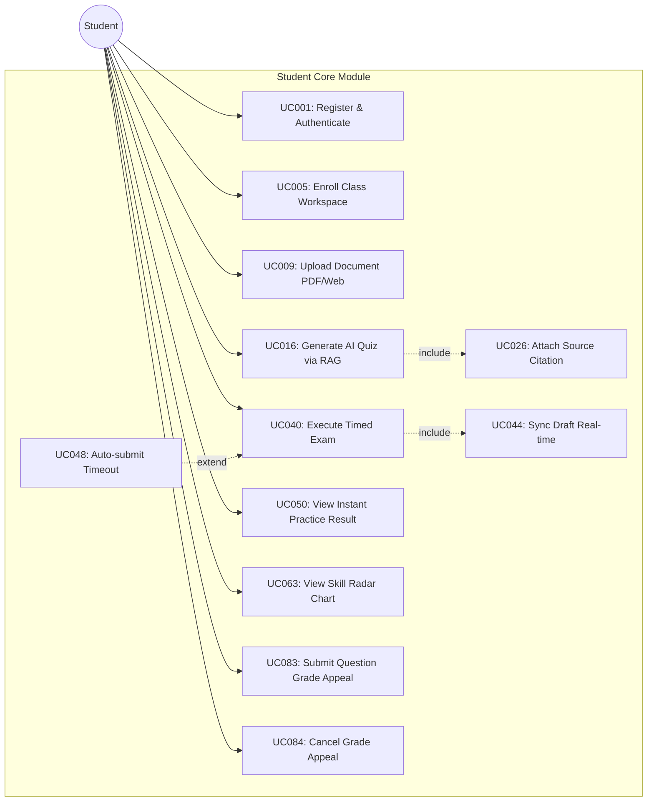
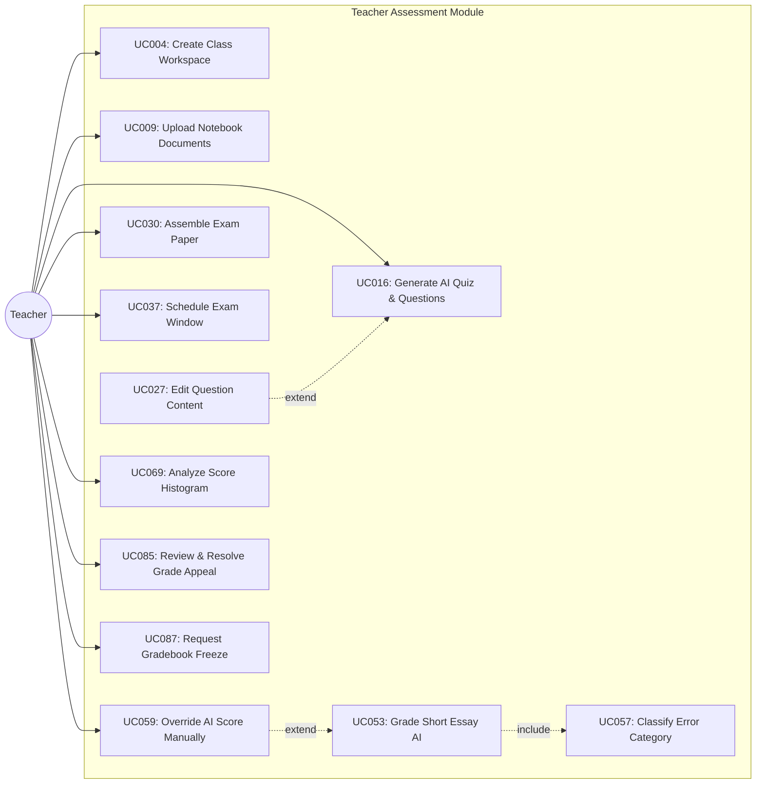
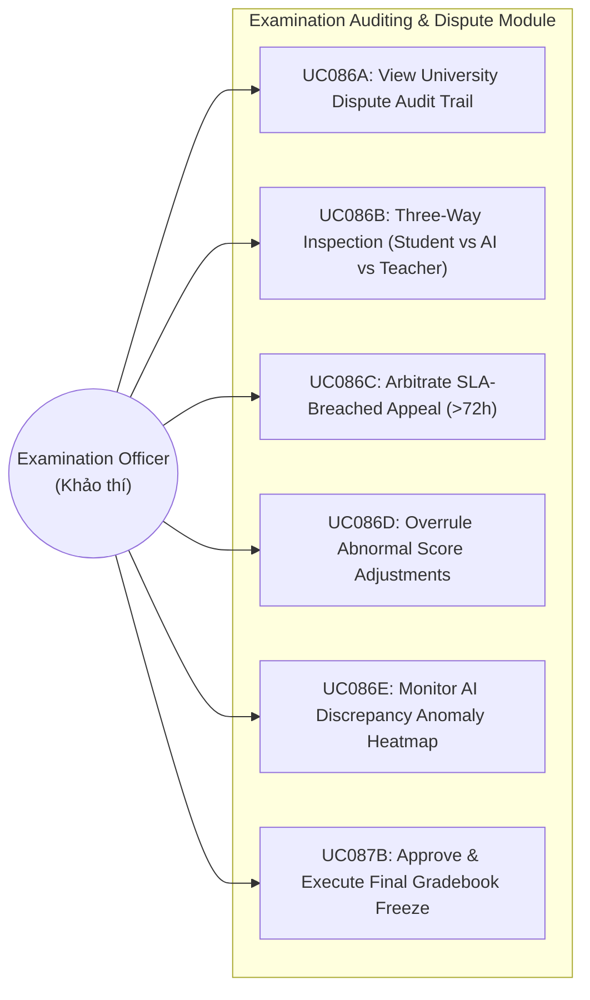
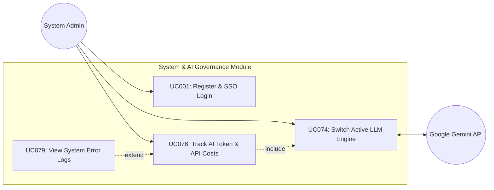
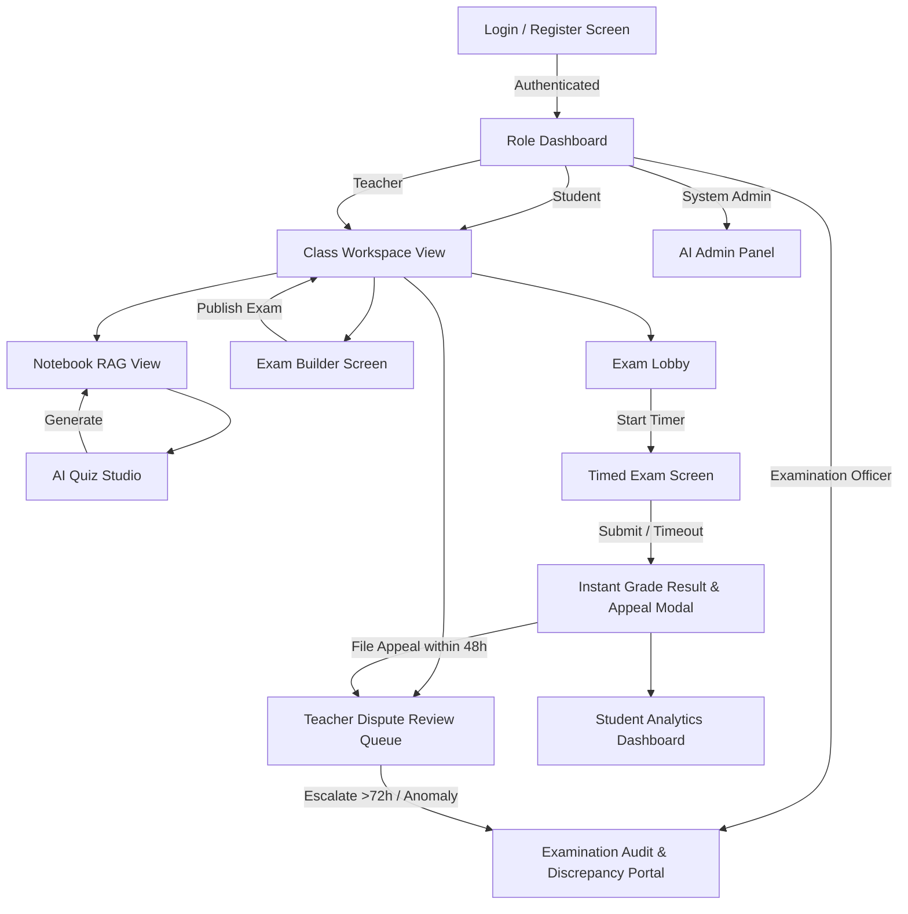
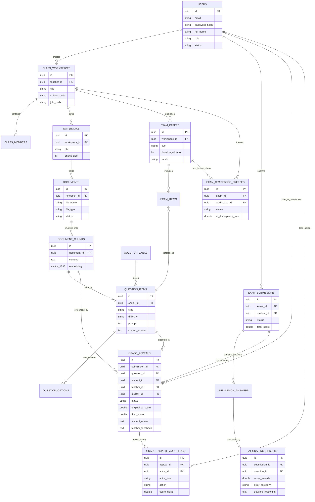
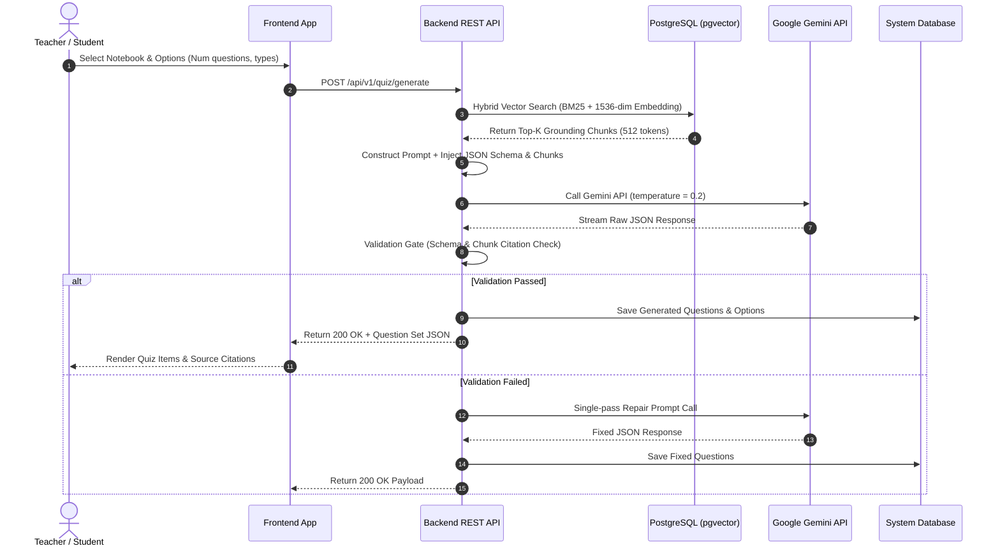
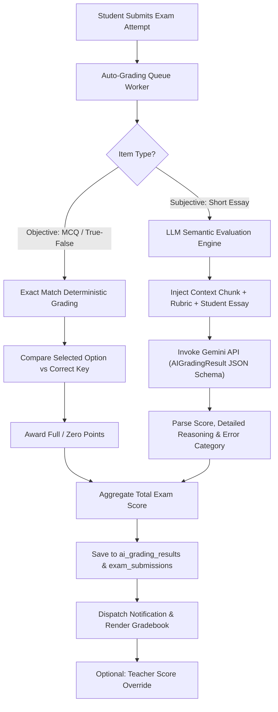
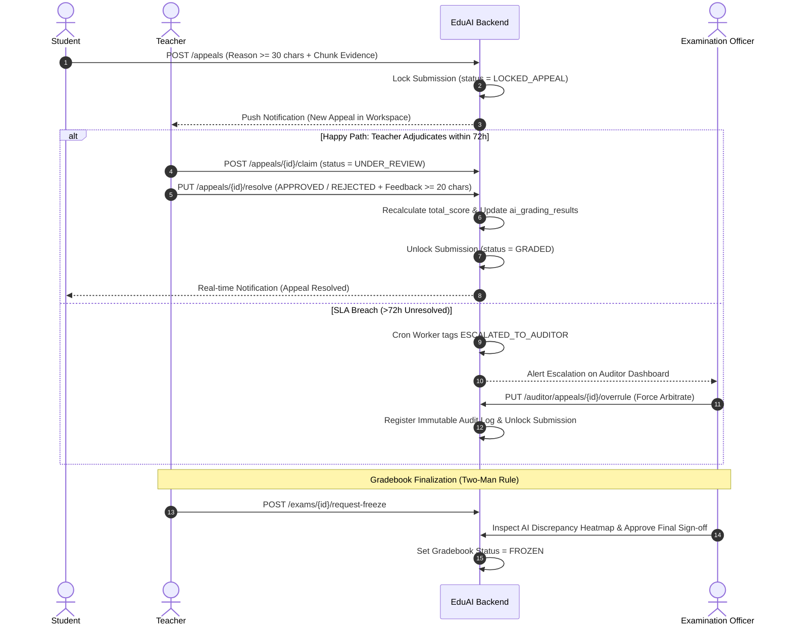

# TRƯỜNG ĐẠI HỌC FPT (FPT UNIVERSITY)
## EduAI - INTELLIGENT LEARNING & ASSESSMENT PLATFORM
### SOFTWARE REQUIREMENT SPECIFICATION (SRS)

| Information Category | Project Specification Details |
| --- | --- |
| **Project Code & Name** | `EDUAI_2026` - EduAI Intelligent Platform |
| **Document Version** | `EDUAI_G5 - v1.3.0` |
| **Course Code / Semester** | Capstone Project / PRM393 - Fall 2026 |
| **Instructor / Mentor** | Lecturer / Supervisor Name |
| **Group Number** | Group 5 |
| **Date & Location** | August 13, 2026 - Hanoi, Vietnam |

---

# I. Record of Changes

| Date | A*, M, D | In charge | Change Description |
| --- | --- | --- | --- |
| 12/08/2026 | A | Software Architecture Team | Initial baseline SRS specification (v1.2.0) covering Core RAG, Exam Builder, and AI Grading. |
| 13/08/2026 | A, M | Software Architecture & Examination Team | v1.3.0: Added Examination Officer (Khảo thí & Đảm bảo Chất lượng) actor, Grade Appeal & Dispute Lifecycle (UC83-UC87), Immutable Audit Logs, Three-Way Inspector, Gradebook Freeze workflow, and BR-AP01 to BR-AP09. |

*\*A - Added, M - Modified, D - Deleted*

---

# II. Software Requirement Specification

## 1. Product Overview

The **EduAI Intelligent Learning & Assessment Platform** is a Next-Generation AI-Powered EdTech system designed for high schools, universities, and educational centers. It combines **NotebookLM-style document RAG** (Retrieval-Augmented Generation), automated multi-format test generation, AI-powered multi-tier grading with error diagnostics, comprehensive Grade Appeal & Dispute Resolution with Examination Auditing, and interactive learning analytics.

### Core Areas of the Platform:
1. **Knowledge Ingestion & Notebook RAG Engine:** Allows teachers and students to upload documents (PDF, DOCX, TXT, Web URLs) into subject-specific Notebooks. Text is chunked (512 tokens) and embedded using vector embeddings (`pgvector`) for accurate context retrieval.
2. **AI-Powered Question & Test Generation:** Generates multi-format questions (Multiple Choice, True/False, Short Essay) directly linked to document chunks with explicit source citations.
3. **Assessment & Exam Execution:** Timed examination environment with real-time auto-draft saving, question shuffling, and timeout auto-submission.
4. **AI Automated Grading & Error Diagnostic Engine:** Combines exact-match auto-grading for objective items with LLM semantic evaluation for subjective essays. Provides root-cause error classification (`CONCEPTUAL_MISUNDERSTANDING`, `CALCULATION_ERROR`, `MISREAD_QUESTION`, `SYNTAX_ERROR`, `INCOMPLETE_LOGIC`).
5. **Grade Dispute, Appeal & Examination Auditing Engine:** Comprehensive human-in-the-loop dispute lifecycle allowing students to appeal questions within 48h with Notebook RAG/External evidence, teachers to review/adjust scores without downside penalty, and Examination Officers to perform 3-way auditing, overrule anomalies, and execute two-man official gradebook freeze.
6. **Analytics & Competency Dashboard:** Renders Skill Radar charts, Common Mistake Matrices, AI Discrepancy Heatmaps, and class score distribution histograms.

### Description of External Entities:
* **Google Gemini API (Gemini 2.0 / 1.5 Flash):** External LLM service used for structured question generation, RAG synthesis, and subjective essay grading via strict JSON Schemas.
* **Local AI / Ollama Engine:** Optional local LLM deployment (e.g., Qwen 2.5, Llama 3) for offline environments and low-latency local inference.
* **Supabase / PostgreSQL (with `pgvector`):** Relational database storing user data, exams, grades, audit logs, and vector embeddings for hybrid dense semantic search.
* **Docker Sandbox Engine (Phase 2 Deferred):** Containerized execution runtime for interactive programming Code Lab challenges.



---

## 2. User Requirements

### 2.1 Actors

| # | Actor | Description |
| --- | --- | --- |
| 1 | **System Admin** | The administrator with highest system privileges. Responsible for configuring active AI model providers (Gemini/Ollama), monitoring daily token usage, managing global quotas, and managing user roles. |
| 2 | **Teacher** | The primary content creator and evaluator. Responsible for creating Class Workspaces, uploading course materials into Notebooks, generating AI quizzes, assembling exam papers, reviewing AI grades, arbitrating student grade appeals, and requesting gradebook freezes. |
| 3 | **Student** | The end learner. Responsible for enrolling in classes via join codes, studying Notebook documents, taking timed exams, viewing instant score results, reviewing AI diagnostic error breakdowns, and filing question grade appeals within 48h. |
| 4 | **Content Admin** | Specialized administrative staff responsible for maintaining shared institutional Question Banks and central learning material repositories. |
| 5 | **Examination Officer (Khảo thí & Đảm bảo chất lượng)** | Independent academic auditor responsible for university-wide dispute oversight, three-way discrepancy auditing (Student vs AI vs Teacher), arbitrating SLA-breached appeals (>72h), overruling abnormal score adjustments, and executing final official gradebook sign-off/freeze. |
| 6 | **Google Gemini API (External)** | External LLM service providing structured JSON question generation, RAG context synthesis, and semantic essay evaluation. |
| 7 | **Local AI Engine (External)** | Alternative local AI provider (Ollama) used for local execution. |

---

### 2.2 Use Cases

#### 2.2.1 Use Case Diagrams

##### Diagram 1: Student Core Learning & Examination Use Cases



##### Diagram 2: Teacher Assessment & Management Use Cases



##### Diagram 3: Examination Officer Auditing & Dispute Resolution Use Cases



##### Diagram 4: System Admin & External AI Integration Use Cases



---

#### 2.2.2 Descriptions

| ID | Group function | Use Case | Actors | Use Case Description & Main Flow |
| --- | --- | --- | --- | --- |
| 1 | Account & Profile Management | Register Account & Authenticate SSO | All Users | **Description:** Register and log in via Google OAuth2, Email/Password, or SSO integration.<br>**Main Flow:** 1. User enters credentials. 2. System validates input. 3. System issues JWT token. 4. User is redirected to Dashboard. |
| 2 | Account & Profile Management | Assign User Roles & Permissions | System Admin | **Description:** Grant system roles: Student, Teacher, Content Admin, Examination Officer, System Admin.<br>**Main Flow:** 1. Admin selects user. 2. Selects new role. 3. System updates permissions in DB. |
| 3 | Account & Profile Management | Update User Profile | All Users | **Description:** Modify personal profile information, avatar image, and UI themes.<br>**Main Flow:** 1. User opens Profile. 2. Updates details. 3. System saves to database. |
| 4 | Account & Profile Management | Create Class Workspace | Teacher | **Description:** Set up a new subject workspace with custom join codes.<br>**Main Flow:** 1. Teacher inputs class name & subject code. 2. System generates 6-char join code. 3. Workspace created. |
| 5 | Account & Profile Management | Enroll in Class Workspace | Student | **Description:** Join a class workspace using unique join codes.<br>**Main Flow:** 1. Student inputs 6-char join code. 2. System verifies code. 3. Adds student to class. |
| 6 | Account & Profile Management | Manage Class Members & Roles | Teacher | **Description:** View enrolled students, suspend access, or manage class roles.<br>**Main Flow:** 1. Teacher views member list. 2. Updates member status or role. |
| 7 | Account & Profile Management | Check Storage Quotas & Token Limits | All Users | **Description:** View document upload storage usage and daily AI token quotas.<br>**Main Flow:** 1. User views settings/profile. 2. System queries usage logs. 3. Displays quota bar. |
| 8 | Account & Profile Management | Reset Password & Configure 2FA | All Users | **Description:** Perform self-service password reset and setup 2FA authentication.<br>**Main Flow:** 1. User inputs email. 2. System sends OTP code. 3. User sets new password. |
| 9 | Document & Knowledge RAG Engine | Upload Single Document File | Teacher, Student | **Description:** Ingest single learning materials in PDF, DOCX, TXT format.<br>**Main Flow:** 1. User drops PDF file. 2. Backend parses text into 512-token chunks. 3. Computes vector embeddings in Pgvector. |
| 10 | Document & Knowledge RAG Engine | Ingest Web Article Content via URL | Teacher, Student | **Description:** Extract and clean article text from web page URLs.<br>**Main Flow:** 1. User inputs URL string. 2. System scrapes text body. 3. Chunks and embeds text. |
| 11 | Document & Knowledge RAG Engine | Monitor Vectorization Progress | All Users | **Description:** Track real-time progress bar of text chunking and vector embedding creation.<br>**Main Flow:** 1. User uploads document. 2. System streams progress percentage (0-100%). |
| 12 | Document & Knowledge RAG Engine | Organize Notebook Folders | All Users | **Description:** Group uploaded documents into categorized Subject Notebooks.<br>**Main Flow:** 1. User creates notebook folder. 2. Assigns uploaded files to folder. |
| 13 | Document & Knowledge RAG Engine | Share Notebook Access Permissions | All Users | **Description:** Grant notebook read/write access permissions to class members.<br>**Main Flow:** 1. User selects notebook. 2. Grants access role to class workspace. |
| 14 | Document & Knowledge RAG Engine | Preview Document & Highlight Text | All Users | **Description:** Render parsed document text with interactive highlight markers.<br>**Main Flow:** 1. User opens document preview. 2. System highlights search chunk citations. |
| 15 | Document & Knowledge RAG Engine | Delete Document & Purge Vectors | All Users | **Description:** Remove documents and permanently delete vector embeddings.<br>**Main Flow:** 1. User selects delete file. 2. System purges chunks and embeddings from Pgvector. |
| 16 | AI Quiz & Question Generation | Generate Quiz from Notebook | Teacher, Student | **Description:** Synthesize multi-topic quizzes sourced from Notebook documents via RAG.<br>**Main Flow:** 1. User selects notebooks & count. 2. Vector search retrieves top-K chunks. 3. Gemini LLM generates JSON quiz. |
| 17 | AI Quiz & Question Generation | Generate Multiple Choice Question | AI Engine | **Description:** Create 4-option MCQs with distractor explanations.<br>**Main Flow:** 1. RAG prompt sent to LLM. 2. LLM generates 1 correct key & 3 distractors. |
| 18 | AI Quiz & Question Generation | Generate True / False Question | AI Engine | **Description:** Create binary True/False question items with contextual rationales.<br>**Main Flow:** 1. LLM evaluates chunk text. 2. Generates True/False prompt with explanation. |
| 19 | AI Quiz & Question Generation | Generate Fill-in-the-Blank Question | AI Engine | **Description:** Create cloze test questions with exact and synonym key matches.<br>**Main Flow:** 1. LLM extracts key terms. 2. Replaces terms with blank markers. |
| 20 | AI Quiz & Question Generation | Generate Short Essay Question | AI Engine | **Description:** Create short answer essay prompts with key concept rubric criteria.<br>**Main Flow:** 1. LLM formulates essay question. 2. Generates multi-criteria rubric. |
| 21 | AI Quiz & Question Generation | Generate Long Essay & Case Study | AI Engine | **Description:** Create analytical essay prompts with multi-tier evaluation rubrics.<br>**Main Flow:** 1. LLM generates case study scenario and analytical prompt. |
| 22 | AI Quiz & Question Generation | Generate Matching Pairs Question | AI Engine | **Description:** Create matching term-definition or premise-response question matrices.<br>**Main Flow:** 1. LLM pairs terms with definitions. 2. Shuffles pairs for test. |
| 23 | AI Quiz & Question Generation | Generate Interactive Code Challenge | AI Engine | **Description:** Create programming problems with starter code, constraints, and testcases.<br>**Main Flow:** 1. LLM generates problem prompt, template code, and I/O testcases. |
| 24 | AI Quiz & Question Generation | Configure Difficulty Ratio Matrix | Teacher | **Description:** Define difficulty ratios (e.g., 30% Easy, 50% Medium, 20% Hard).<br>**Main Flow:** 1. Teacher sets percentage sliders. 2. Generator enforces ratio. |
| 25 | AI Quiz & Question Generation | Generate Step-by-step Rationale | AI Engine | **Description:** Synthesize detailed step-by-step explanations for every question.<br>**Main Flow:** 1. LLM appends detailed explanation field to question schema output. |
| 26 | AI Quiz & Question Generation | Attach Source Citation Linkage | AI Engine | **Description:** Link exact chunk ID and text quote citations to generated questions.<br>**Main Flow:** 1. System verifies grounding chunk ID. 2. Links quote citation. |
| 27 | AI Quiz & Question Generation | Edit Question Content Manually | Teacher | **Description:** Modify AI-generated question text, choices, point weightings, or rubrics.<br>**Main Flow:** 1. Teacher opens question editor. 2. Modifies text/options. 3. Saves update. |
| 28 | AI Quiz & Question Generation | Regenerate Single Question Item | Teacher, Student | **Description:** Re-run AI generation for a single problematic question item.<br>**Main Flow:** 1. User clicks regenerate on item. 2. LLM re-invokes RAG prompt for 1 item. |
| 29 | AI Quiz & Question Generation | Save Question to Question Bank | Teacher | **Description:** Save verified question items into central class Question Banks.<br>**Main Flow:** 1. Teacher selects items. 2. Chooses target Question Bank. 3. Persists records. |
| 30 | Exam & Question Bank Management | Assemble Exam Paper Manually | Teacher | **Description:** Select specific items from Question Banks to construct an exam paper.<br>**Main Flow:** 1. Teacher picks questions from bank. 2. Orders questions. 3. Creates exam paper. |
| 31 | Exam & Question Bank Management | Auto-assemble Exam from Matrix | Teacher | **Description:** Automatically assemble exam papers matching topic distributions.<br>**Main Flow:** 1. Teacher inputs topic matrix. 2. System queries bank and picks items. |
| 32 | Exam & Question Bank Management | Configure Exam Timer & Pace | Teacher | **Description:** Set countdown timers, per-question time limits, or practice mode.<br>**Main Flow:** 1. Teacher sets duration in minutes (e.g., 60 mins). 2. Saves exam settings. |
| 33 | Exam & Question Bank Management | Select Exam Execution Mode | Teacher | **Description:** Toggle Practice Mode (instant feedback) vs Official Exam Mode.<br>**Main Flow:** 1. Teacher toggles mode switch. 2. System updates exam execution behavior. |
| 34 | Exam & Question Bank Management | Enable Anti-Cheating Restrictions | Teacher | **Description:** Activate browser restrictions: tab switch warnings and fullscreen mode.<br>**Main Flow:** 1. Teacher enables strict mode. 2. Exam client enforces focus monitoring. |
| 35 | Exam & Question Bank Management | Define Lab Testcases & Limits | Teacher | **Description:** Configure input/output testcases and execution constraints for code labs.<br>**Main Flow:** 1. Teacher inputs testcase I/O pairs and CPU/RAM limits. |
| 36 | Exam & Question Bank Management | Assign Point Weightings | Teacher | **Description:** Customize point values for individual questions or exam sections.<br>**Main Flow:** 1. Teacher assigns point values per item. 2. System updates max score. |
| 37 | Exam & Question Bank Management | Schedule Exam Availability Window | Teacher | **Description:** Set open/close start dates, submission hard-deadlines, and late rules.<br>**Main Flow:** 1. Teacher sets start and end datetime. 2. Exam opens automatically. |
| 38 | Exam & Question Bank Management | Export Exam Paper to PDF/Word | Teacher | **Description:** Export formatted exam sheets and separate answer keys for printing.<br>**Main Flow:** 1. Teacher clicks Export. 2. System generates PDF/DOCX download payload. |
| 39 | Exam & Question Bank Management | Archive Past Exam Paper | Teacher | **Description:** Archive past exam papers while preserving student submission records.<br>**Main Flow:** 1. Teacher clicks Archive. 2. Exam status updates to ARCHIVED. |
| 40 | Test Execution & Sandbox | Answer Objective Item Questions | Student | **Description:** Select option choices for MCQ and True/False question items.<br>**Main Flow:** 1. Student selects radio option. 2. Answer stored in client state. |
| 41 | Test Execution & Sandbox | Compose Essay Answer with LaTeX | Student | **Description:** Enter essay responses using rich text editor with MathJax LaTeX.<br>**Main Flow:** 1. Student types essay response. 2. Editor renders LaTeX math formulas. |
| 42 | Test Execution & Sandbox | Write Code in Embedded IDE | Student | **Description:** Write code in embedded Monaco Editor with syntax highlighting.<br>**Main Flow:** 1. Student writes code in IDE editor. 2. Console captures output. |
| 43 | Test Execution & Sandbox | Execute Testcases in Sandbox | Student | **Description:** Test code against public testcases inside Docker sandbox container.<br>**Main Flow:** 1. Student clicks Run Testcases. 2. Code executes in container. 3. Displays output. |
| 44 | Test Execution & Sandbox | Sync Draft Answer Real-time | Student | **Description:** Automatically save student responses to backend DB every 10 seconds.<br>**Main Flow:** 1. Silent timer triggers every 10s. 2. Client posts draft answers to API. |
| 45 | Test Execution & Sandbox | Flag Question for Review | Student | **Description:** Mark uncertain questions for later review before finalizing exam attempt.<br>**Main Flow:** 1. Student clicks Flag icon. 2. Palette marks question yellow. |
| 46 | Test Execution & Sandbox | Request AI Scaffold Hint | Student | **Description:** Request progressive AI hints during practice mode with score penalties.<br>**Main Flow:** 1. Student clicks Request Hint. 2. Gemini returns progressive clue. |
| 47 | Test Execution & Sandbox | Track Tab Switching & Focus Loss | Student, System | **Description:** Track tab focus loss events; log warnings and trigger auto-submit.<br>**Main Flow:** 1. Client detects tab blur event. 2. Logs warning to backend. 3. Auto-submits if >3 limit. |
| 48 | Test Execution & Sandbox | Auto-submit Exam on Timeout | System | **Description:** Automatically finalize and submit student exam attempt when timer hits 0.<br>**Main Flow:** 1. Timer hits 0. 2. System locks inputs and submits current draft. |
| 49 | Test Execution & Sandbox | Submit Exam Paper Manually | Student | **Description:** Review submission summary screen and manually confirm test completion.<br>**Main Flow:** 1. Student clicks Submit Exam. 2. Confirms dialog. 3. Submission finalized. |
| 50 | Test Execution & Sandbox | View Instant Practice Result | Student | **Description:** Access immediate score breakdown and AI explanations upon submit.<br>**Main Flow:** 1. Practice exam submitted. 2. System renders score, keys, and rationales. |
| 51 | Test Execution & Sandbox | Review Exam Attempt History | Student | **Description:** Browse past completed attempts, time spent per question, and grade details.<br>**Main Flow:** 1. Student opens history tab. 2. Clicks past attempt to view details. |
| 52 | AI Grading & Error Diagnostics | Grade Objective Items Auto | System | **Description:** Perform instant deterministic grading for MCQ and True/False questions.<br>**Main Flow:** 1. Exam submitted. 2. System compares student choices against keys. 3. Awards points. |
| 53 | AI Grading & Error Diagnostics | Grade Short Essay via AI Semantic | AI Engine | **Description:** Evaluate short essays against rubrics using semantic similarity & LLM.<br>**Main Flow:** 1. Queue picks up essay. 2. Sends prompt+rubric+essay to Gemini. 3. Receives score & reasoning. |
| 54 | AI Grading & Error Diagnostics | Grade Long Essay Analytical | AI Engine | **Description:** Evaluate analytical essays across Content, Logic, and Structure.<br>**Main Flow:** 1. LLM evaluates essay across 3 rubric dimensions. 2. Outputs itemized scores. |
| 55 | AI Grading & Error Diagnostics | Run Code Lab in Sandbox | Sandbox Engine | **Description:** Execute student code against hidden testcases in Docker sandbox.<br>**Main Flow:** 1. Sandbox runs code vs hidden testcases. 2. Calculates pass rate & score. |
| 56 | AI Grading & Error Diagnostics | Generate Detailed Error Breakdown | AI Engine | **Description:** Synthesize point-by-point explanations of student mistakes anchored in chunks.<br>**Main Flow:** 1. LLM compares student answer vs ground truth. 2. Explains exact error point. |
| 57 | AI Grading & Error Diagnostics | Classify Root Cause Error Category | AI Engine | **Description:** Tag mistake root cause (`CONCEPTUAL_MISUNDERSTANDING`, `CALCULATION_ERROR`, etc.).<br>**Main Flow:** 1. LLM analyzes error type. 2. Assigns exact taxonomy category tag. |
| 58 | AI Grading & Error Diagnostics | Compare Code vs Golden Solution | AI Engine | **Description:** Display side-by-side diff comparison between student response and golden code.<br>**Main Flow:** 1. System renders diff viewer comparing student code with benchmark. |
| 59 | AI Grading & Error Diagnostics | Override AI Grade Manually | Teacher | **Description:** Adjust AI-assigned scores, edit rubric breakdowns, or re-grade items.<br>**Main Flow:** 1. Teacher views AI grade. 2. Inputs new score and reason. 3. System updates DB. |
| 60 | AI Grading & Error Diagnostics | Append Custom Teacher Feedback | Teacher | **Description:** Attach manual text comments or feedback to AI grading outputs.<br>**Main Flow:** 1. Teacher types feedback note. 2. Appends note to student result view. |
| 61 | AI Grading & Error Diagnostics | Synthesize Golden Reference Answer | AI Engine | **Description:** Generate optimal reference answer anchored in document notebook sources.<br>**Main Flow:** 1. LLM synthesizes benchmark golden answer from document chunks. |
| 62 | AI Grading & Error Diagnostics | Consolidate & Export Gradebook | Teacher | **Description:** Aggregate final class grades and export gradebook to CSV or Excel.<br>**Main Flow:** 1. Teacher clicks Export Gradebook. 2. System exports CSV file payload. |
| 63 | Learning Analytics & Dashboard | View Personal Dashboard | Student | **Description:** View overall GPA, completed tests count, study velocity, and weak topics.<br>**Main Flow:** 1. Student opens Dashboard. 2. System queries submission stats & GPA. |
| 64 | Learning Analytics & Dashboard | View Common Mistake Matrix | Student, Teacher | **Description:** Render visual matrix showing top recurring conceptual error types.<br>**Main Flow:** 1. System aggregates `ai_grading_results` error tags. 2. Renders matrix grid. |
| 65 | Learning Analytics & Dashboard | View Skill Radar Chart | Student, Teacher | **Description:** Render spider radar chart illustrating competency levels across topics.<br>**Main Flow:** 1. System computes topic competency scores. 2. Renders radar chart. |
| 66 | Learning Analytics & Dashboard | Generate AI Learning Plan | AI Engine | **Description:** Synthesize tailored study recommendations addressing identified weak areas.<br>**Main Flow:** 1. System queries weak radar topics. 2. Gemini generates study plan. |
| 67 | Learning Analytics & Dashboard | Generate Spaced Flashcards | AI Engine | **Description:** Auto-generate Anki-style flashcards from missed exam questions.<br>**Main Flow:** 1. System selects missed questions. 2. Generates front/back flashcards. |
| 68 | Learning Analytics & Dashboard | Generate Remediation Quiz | Student | **Description:** Auto-create a fresh practice quiz composed of previously missed concepts.<br>**Main Flow:** 1. Student clicks Remediation Quiz. 2. Generator queries past mistake topics. |
| 69 | Learning Analytics & Dashboard | Analyze Class Score Distribution | Teacher | **Description:** Display mean, median, standard deviation, and grade distribution.<br>**Main Flow:** 1. Teacher views class stats. 2. System plots score distribution histogram. |
| 70 | Learning Analytics & Dashboard | Identify Problematic Questions | Teacher | **Description:** Highlight questions with low discrimination index or high failure rates.<br>**Main Flow:** 1. System analyzes question failure rates. 2. Flags problematic items. |
| 71 | Learning Analytics & Dashboard | Track Learning Velocity Trends | Teacher | **Description:** Monitor student progress trends over weekly and monthly timeframes.<br>**Main Flow:** 1. System queries time-series scores. 2. Plots velocity line chart. |
| 72 | Learning Analytics & Dashboard | Export Competency Report PDF | Student, Teacher | **Description:** Download formal student progress and skill competency PDF reports.<br>**Main Flow:** 1. User clicks Export PDF. 2. System compiles competency PDF report. |
| 73 | Learning Analytics & Dashboard | Recommend Remedial Reading | AI Engine | **Description:** Direct students to specific document pages/chunks based on exam errors.<br>**Main Flow:** 1. System maps mistake question chunk IDs. 2. Displays direct links. |
| 74 | System Admin & Guardrails | Switch Active LLM Provider | System Admin | **Description:** Toggle active AI models (Google Gemini API, Local AI / Ollama).<br>**Main Flow:** 1. Admin selects AI model. 2. System updates configuration & fallback. |
| 75 | System Admin & Guardrails | Manage System Prompt Templates | System Admin | **Description:** Version-control system prompts for question generation and grading.<br>**Main Flow:** 1. Admin edits system prompt text. 2. Saves new prompt version. |
| 76 | System Admin & Guardrails | Track AI Token Usage & API Costs | System Admin | **Description:** Monitor real-time token consumption, API costs per class, and quotas.<br>**Main Flow:** 1. Admin opens Token Tracker. 2. System displays token consumption logs. |
| 77 | System Admin & Guardrails | Configure Rate Limits & Quotas | System Admin | **Description:** Set daily AI request caps per student/teacher to control API budgets.<br>**Main Flow:** 1. Admin inputs daily token caps. 2. System enforces quota limits. |
| 78 | System Admin & Guardrails | Configure Safety & Moderation | System Admin | **Description:** Set up profanity filters, harmful content blocking, and injection guards.<br>**Main Flow:** 1. Admin configures safety thresholds. 2. System filters AI inputs. |
| 79 | System Admin & Guardrails | View Exception & Error Logs | System Admin | **Description:** Inspect application logs, AI API timeouts, and execution error stack traces.<br>**Main Flow:** 1. Admin opens System Logs. 2. System renders log entries with filters. |
| 80 | System Admin & Guardrails | Configure Maintenance Mode | System Admin | **Description:** Broadcast system announcements and toggle maintenance window states.<br>**Main Flow:** 1. Admin toggles maintenance mode. 2. System displays banner to users. |
| 81 | System Admin & Guardrails | Backup Database Snapshots | System Admin | **Description:** Trigger maintenance tasks and vector database snapshot backups.<br>**Main Flow:** 1. Admin clicks Backup Database. 2. System triggers snapshot process. |
| 82 | System Admin & Guardrails | Audit Performance & Latency | System Admin | **Description:** Monitor vector search latency and API response performance metrics.<br>**Main Flow:** 1. Admin views performance metrics. 2. System displays latency charts. |
| 83 | Grade Dispute & Auditing | Submit Question Grade Appeal | Student | **Description:** Create appeal against question grade within 48h, attaching Notebook Chunk or external reference.<br>**Main Flow:** 1. Student selects question. 2. Inputs reason ($\ge$ 30 chars) & evidence. 3. System creates `grade_appeals` record and locks submission. |
| 84 | Grade Dispute & Auditing | Cancel Grade Appeal | Student | **Description:** Withdraw submitted grade appeal prior to teacher claim.<br>**Main Flow:** 1. Student opens appeal. 2. Clicks Cancel. 3. System updates status to `CANCELLED` and unlocks submission if clean. |
| 85 | Grade Dispute & Auditing | Review & Resolve Grade Appeal | Teacher | **Description:** Claim and adjudicate student dispute with zero-downside adjustment rule.<br>**Main Flow:** 1. Teacher claims appeal. 2. Reviews 3-way context. 3. Submits `APPROVED` / `REJECTED` with $\ge$ 20 chars feedback. 4. System updates score and submission status. |
| 86 | Grade Dispute & Auditing | Audit & Arbitrate Grade Dispute | Examination Officer | **Description:** Perform university-wide three-way auditing, resolve SLA-breached cases (>72h), and overrule abnormal adjustments.<br>**Main Flow:** 1. Auditor filters appeals or anomaly flags. 2. Inspects 3-way view. 3. Enforces resolution or overrule. 4. Writes immutable audit log. |
| 87 | Grade Dispute & Auditing | Request & Execute Gradebook Freeze | Teacher, Examination Officer | **Description:** Teacher requests gradebook close; Examination Officer verifies and executes final sign-off.<br>**Main Flow:** 1. Teacher clicks Request Freeze. 2. Auditor inspects AI discrepancy metrics. 3. Auditor approves Final Sign-off. 4. Gradebook status changes to `FROZEN`. |

---

## 3. Software Features & Technical Architecture

### 3.1 Functional Overview & System Architecture

#### 3.1.1 Screens Flow Diagram



#### 3.1.2 Screen Descriptions

| # | Feature Area | Screen Name | Description |
| --- | --- | --- | --- |
| 1 | Authentication | Login / Register | Initial entry screen for email/password and Google OAuth2 SSO authentication. |
| 2 | Authentication | User Profile | Global interface for users to update profile details, avatar, and system preferences. |
| 3 | Class Workspace | Class Dashboard | Central workspace view showing class members, assigned notebooks, and exam papers. |
| 4 | Document RAG | Notebook View | Interface to upload PDF/DOCX/Web URLs, view chunking progress, and preview text. |
| 5 | AI Question Gen | AI Quiz Studio | Generator screen to select notebooks, set difficulty mix, and generate questions. |
| 6 | Question Bank | Question Bank List | Centralized repository to view, edit, search, and organize verified question items. |
| 7 | Exam Management | Exam Builder | Screen for teachers to assemble exam papers, set countdown timers, and schedule windows. |
| 8 | Test Execution | Timed Exam Lobby & Screen | Student exam taking interface with countdown timer, LaTeX editor, and auto-save draft. |
| 9 | AI Grading | Grading & Diagnostics View | Detailed gradebook view showing auto-graded scores, AI essay reasoning, and error categories. |
| 10 | Analytics | Student Analytics Dashboard | Visual analytics screen displaying GPA velocity, Skill Radar chart, and Mistake Matrix. |
| 11 | System Admin | AI Admin Panel | System admin dashboard to toggle AI provider models (Gemini/Ollama) and view token costs. |
| 12 | Grade Dispute & Audit | Examination Audit Portal | Central portal for Examination Officers to monitor disputes university-wide, SLA breaches, and AI discrepancy heatmaps. |
| 13 | Grade Dispute & Audit | Three-Way Inspection Modal | Comparative inspection screen displaying Student Response vs AI Grading vs Teacher Adjudication with overrule actions. |
| 14 | Grade Dispute & Audit | Student Grade Appeal Modal | Interactive modal for students to submit dispute rationale ($\ge$ 30 chars) and attach Notebook chunk citations within 48h. |
| 15 | Grade Dispute & Audit | Teacher Dispute Review Queue | Workspace queue for teachers to claim, review evidence chunks, adjust scores (no downside), and request gradebook freeze. |

---

#### 3.1.3 Screen Authorization Matrix

| # | Screen / Feature Action | Student | Teacher | Content Admin | Examination Officer | System Admin |
| --- | --- | :---: | :---: | :---: | :---: | :---: |
| 1 | Register / Login / Profile (`UC001`, `UC003`) | X | X | X | X | X |
| 2 | Create & Manage Class Workspace (`UC004`, `UC006`) | - | X | - | - | X |
| 3 | Enroll in Class Workspace (`UC005`) | X | - | - | - | - |
| 4 | Upload Document & Manage Notebooks (`UC009`, `UC010`, `UC012`, `UC015`) | X | X | X | - | X |
| 5 | Generate AI Quiz & Questions (`UC016`, `UC017`, `UC018`, `UC020`) | X | X | X | - | X |
| 6 | Edit & Save to Question Bank (`UC027`, `UC029`) | - | X | X | - | X |
| 7 | Assemble & Schedule Exam Paper (`UC030`, `UC032`, `UC033`, `UC037`) | - | X | - | - | X |
| 8 | Execute Timed Exam & Auto-save (`UC040`, `UC041`, `UC044`, `UC049`) | X | - | - | - | - |
| 9 | View AI Grading Results & Diagnostic Explanations (`UC050`, `UC051`, `UC056`, `UC057`) | X | X | X | X | X |
| 10 | Override AI Grade Manually (`UC059`) | - | X | - | - | X |
| 11 | View Performance Dashboard & Skill Radar (`UC063`, `UC064`, `UC065`, `UC069`) | X | X | X | X | X |
| 12 | Configure AI Providers & Monitor Token Costs (`UC074`, `UC076`) | - | - | - | - | X |
| 13 | Submit / Cancel Question Grade Appeal (`UC083`, `UC084`) | X | - | - | - | - |
| 14 | Claim & Resolve Class Grade Appeals (`UC085`) | - | X | - | - | X |
| 15 | University-wide Three-Way Audit, Overrule & Final Sign-off (`UC086`, `UC087`) | - | - | - | X | X |

---

#### 3.1.4 Non-Screen System Functions

| # | Feature Module | System Function Name | Description |
| --- | --- | --- | --- |
| 1 | Document RAG | Background Vectorization Worker | Asynchronous backend task listening for document uploads, parsing text into 512-token chunks, computing 1536-dim vector embeddings, and saving to PostgreSQL `pgvector`. |
| 2 | AI Grading Engine | Auto-Grading Queue Worker | Background queue processing student exam submissions: runs exact-match grading for objective items and dispatches LLM API requests for essay grading. |
| 3 | Test Execution | Real-time Auto-Save Sync | Silent background timer running every 10 seconds on client UI to sync draft answers to database without freezing UI interaction. |
| 4 | Security & Safety | Local PII Sanitizer | Local filter masking student personal identifiers (names, student IDs, emails) before transmitting context text payloads to external LLM APIs. |
| 5 | Grade Dispute & Audit | SLA Escalation Watcher | Scheduled cron worker scanning for unresolved appeals $> 72$ hours, escalating status to `ESCALATED_TO_AUDITOR` and alerting Examination Officers. |
| 6 | Grade Dispute & Audit | AI Anomaly Detector | Automated evaluator flagging exams where appeal rate $\ge 20\%$ or score discrepancy $> 30\%$, tagging records with `is_anomaly_flagged = TRUE`. |

---

### 3.1.5 Entity Relationship Diagram & Entity Descriptions



#### Entity Overview Table

| # | Entity Name | Description |
| --- | --- | --- |
| 1 | `users` | Stores system account data (Students, Teachers, Examination Officers, Admins) including authentication credentials and roles. |
| 2 | `class_workspaces` | Stores subject class workspaces created by teachers with unique join codes. |
| 3 | `class_members` | Junction table mapping user enrollment inside class workspaces with specific permissions. |
| 4 | `notebooks` | Groups uploaded learning documents by subject topics. |
| 5 | `documents` | Stores uploaded source files (PDF, DOCX, TXT, Web URL) metadata. |
| 6 | `document_chunks` | Stores parsed text chunks (512 tokens max) and associated 1536-dim Pgvector embeddings. |
| 7 | `question_banks` | Central repositories holding verified question items organized by class subjects. |
| 8 | `question_items` | Individual question items (MCQ, True/False, Short Essay) with prompts and rubrics. |
| 9 | `question_options` | Answer options for Multiple Choice Question items indicating correct key distractors. |
| 10 | `exam_papers` | Exam papers assembled from question items with countdown timers and scheduled windows. |
| 11 | `exam_items` | Junction table linking specific question items to exam papers with assigned point weightings. |
| 12 | `exam_submissions` | Student exam attempt records capturing submission status (`IN_PROGRESS`, `SUBMITTED`, `GRADED`, `LOCKED_APPEAL`), start time, and final score. |
| 13 | `submission_answers` | Student answer entries submitted for individual questions in an exam attempt. |
| 14 | `ai_grading_results` | Detailed AI evaluation outputs storing scores, reasoning, and error classification taxonomy. |
| 15 | `mistake_logs` | Aggregated records tracking student mistake occurrences to power Mistake Matrix analytics. |
| 16 | `token_usage_logs` | Tracks real-time LLM token consumption and estimated API cost per request. |
| 17 | `grade_appeals` | Records question-level dispute petitions submitted by students with evidence citations and adjudication outcomes. |
| 18 | `grade_dispute_audit_logs` | Immutable audit trail tracking every score change, claim event, overrule, and rationale note. |
| 19 | `exam_gradebook_freezes` | Manages the formal two-man sign-off workflow to lock class gradebooks officially. |

---

### 3.1.6 Entity Details (Database Design Specification)

#### 1. Entity: `users`

| # | Attribute name | PK/FK | Type | Mandatory | Description |
| --- | --- | --- | --- | --- | --- |
| 1 | `id` | PK | UUID | Yes | Unique primary identifier of the user. |
| 2 | `email` | - | String | Yes | User email address used as login username. Must be unique. |
| 3 | `password_hash` | - | String | Yes | One-way encrypted password string using BCrypt algorithm. |
| 4 | `full_name` | - | String | Yes | Full legal name of the user. |
| 5 | `avatar_url` | - | String | No | HTTPS URL to uploaded avatar image. |
| 6 | `role` | - | String | Yes | User role (`SYSTEM_ADMIN`, `TEACHER`, `STUDENT`, `CONTENT_ADMIN`, `EXAMINATION_OFFICER`). |
| 7 | `status` | - | String | Yes | Account status (`ACTIVE`, `SUSPENDED`, `INACTIVE`). |
| 8 | `created_at` | - | Timestamp | Yes | Date and time when the user account was created. |

#### 2. Entity: `class_workspaces`

| # | Attribute name | PK/FK | Type | Mandatory | Description |
| --- | --- | --- | --- | --- | --- |
| 1 | `id` | PK | UUID | Yes | Unique identifier of the class workspace. |
| 2 | `teacher_id` | FK | UUID | Yes | References `users(id)`. The teacher who created the workspace. |
| 3 | `title` | - | String | Yes | Name/Title of the class (e.g., "Software Architecture 2026"). |
| 4 | `subject_code` | - | String | Yes | Subject code identifier (e.g., "PRM393"). |
| 5 | `join_code` | - | String | Yes | Unique 6-character alphanumeric code used by students to enroll. |
| 6 | `description` | - | Text | No | Detailed description and syllabus notes for the class. |
| 7 | `created_at` | - | Timestamp | Yes | Date and time when the workspace was created. |

#### 3. Entity: `notebooks`

| # | Attribute name | PK/FK | Type | Mandatory | Description |
| --- | --- | --- | --- | --- | --- |
| 1 | `id` | PK | UUID | Yes | Unique identifier of the subject notebook. |
| 2 | `workspace_id` | FK | UUID | Yes | References `class_workspaces(id)`. |
| 3 | `creator_id` | FK | UUID | Yes | References `users(id)`. User who created the notebook. |
| 4 | `title` | - | String | Yes | Title of the notebook (e.g., "Chapter 1 - RAG Fundamentals"). |
| 5 | `chunk_size` | - | Integer | Yes | Token chunking size configuration (Default: 512). |
| 6 | `overlap_pct` | - | Integer | Yes | Token overlap percentage (Default: 10%). |
| 7 | `created_at` | - | Timestamp | Yes | Date and time when the notebook was created. |

#### 4. Entity: `documents`

| # | Attribute name | PK/FK | Type | Mandatory | Description |
| --- | --- | --- | --- | --- | --- |
| 1 | `id` | PK | UUID | Yes | Unique identifier of the uploaded document file. |
| 2 | `notebook_id` | FK | UUID | Yes | References `notebooks(id)`. |
| 3 | `file_name` | - | String | Yes | Original file name (e.g., "Architecture_Spec.pdf"). |
| 4 | `file_type` | - | String | Yes | File extension/type (`PDF`, `DOCX`, `TXT`, `WEB_URL`). |
| 5 | `file_size_bytes`| - | Long | Yes | File size in bytes. |
| 6 | `status` | - | String | Yes | Parsing status (`PROCESSING`, `COMPLETED`, `FAILED`). |
| 7 | `created_at` | - | Timestamp | Yes | Timestamp of document upload. |

#### 5. Entity: `document_chunks`

| # | Attribute name | PK/FK | Type | Mandatory | Description |
| --- | --- | --- | --- | --- | --- |
| 1 | `id` | PK | UUID | Yes | Unique identifier of the document chunk. |
| 2 | `document_id` | FK | UUID | Yes | References `documents(id)`. |
| 3 | `notebook_id` | FK | UUID | Yes | References `notebooks(id)`. |
| 4 | `content` | - | Text | Yes | Extracted raw text content of the chunk (512 tokens max). |
| 5 | `token_count` | - | Integer | Yes | Exact token count of the chunk text. |
| 6 | `page_number` | - | Integer | No | Page number in original document if available. |
| 7 | `embedding` | - | Vector(1536)| Yes | 1536-dimensional vector embedding stored via `pgvector`. |

#### 6. Entity: `question_items`

| # | Attribute name | PK/FK | Type | Mandatory | Description |
| --- | --- | --- | --- | --- | --- |
| 1 | `id` | PK | UUID | Yes | Unique identifier of the question item. |
| 2 | `question_bank_id`| FK | UUID | No | References `question_banks(id)` if saved to bank. |
| 3 | `chunk_id` | FK | UUID | Yes | References `document_chunks(id)` for citation. |
| 4 | `type` | - | String | Yes | Question item type (`MULTIPLE_CHOICE`, `TRUE_FALSE`, `SHORT_ESSAY`, `CODE_LAB`). |
| 5 | `difficulty` | - | String | Yes | Difficulty level (`EASY`, `MEDIUM`, `HARD`, `EXPERT`). |
| 6 | `prompt` | - | Text | Yes | The question prompt text. |
| 7 | `correct_answer` | - | Text | Yes | Ground truth correct answer or model golden answer. |
| 8 | `explanation` | - | Text | Yes | Step-by-step resolution rationale. |
| 9 | `created_at` | - | Timestamp | Yes | Date and time when question was generated. |

#### 7. Entity: `exam_papers`

| # | Attribute name | PK/FK | Type | Mandatory | Description |
| --- | --- | --- | --- | --- | --- |
| 1 | `id` | PK | UUID | Yes | Unique identifier of the exam paper. |
| 2 | `workspace_id` | FK | UUID | Yes | References `class_workspaces(id)`. |
| 3 | `title` | - | String | Yes | Exam paper title (e.g., "Midterm Exam - Software Spec"). |
| 4 | `duration_minutes`| - | Integer | Yes | Total countdown timer duration in minutes (e.g., 60). |
| 5 | `mode` | - | String | Yes | Mode (`PRACTICE`, `OFFICIAL_EXAM`). |
| 6 | `start_time` | - | Timestamp | Yes | Scheduled open timestamp. |
| 7 | `end_time` | - | Timestamp | Yes | Scheduled hard-deadline close timestamp. |

#### 8. Entity: `exam_submissions`

| # | Attribute name | PK/FK | Type | Mandatory | Description |
| --- | --- | --- | --- | --- | --- |
| 1 | `id` | PK | UUID | Yes | Unique identifier of the student exam submission attempt. |
| 2 | `exam_id` | FK | UUID | Yes | References `exam_papers(id)`. |
| 3 | `student_id` | FK | UUID | Yes | References `users(id)`. |
| 4 | `status` | - | String | Yes | Status (`IN_PROGRESS`, `SUBMITTED`, `GRADED`, `LOCKED_APPEAL`). |
| 5 | `total_score` | - | Double | No | Total calculated score awarded. |
| 6 | `max_score` | - | Double | Yes | Maximum possible score for the exam paper. |
| 7 | `started_at` | - | Timestamp | Yes | Timestamp when student initiated exam. |
| 8 | `submitted_at` | - | Timestamp | No | Timestamp when exam attempt was finalized. |
| 9 | `published_at` | - | Timestamp | No | Timestamp when official score was published to student. |

#### 9. Entity: `ai_grading_results`

| # | Attribute name | PK/FK | Type | Mandatory | Description |
| --- | --- | --- | --- | --- | --- |
| 1 | `id` | PK | UUID | Yes | Unique identifier of the AI grading result. |
| 2 | `submission_id` | FK | UUID | Yes | References `exam_submissions(id)`. |
| 3 | `question_id` | FK | UUID | Yes | References `question_items(id)`. |
| 4 | `score_awarded` | - | Double | Yes | Points awarded by AI or updated via dispute resolution. |
| 5 | `error_category` | - | String | Yes | Root cause category tag (`NONE`, `CONCEPTUAL_MISUNDERSTANDING`, `CALCULATION_ERROR`, `MISREAD_QUESTION`, `SYNTAX_ERROR`, `INCOMPLETE_LOGIC`). |
| 6 | `detailed_reasoning`| - | Text | Yes | Detailed AI reasoning explaining score deduction. |
| 7 | `improvement_hint` | - | Text | No | Direct remediation guidance for student improvement. |
| 8 | `overridden_by` | FK | UUID | No | References `users(id)` if score was updated by teacher/auditor. |

#### 10. Entity: `class_members`

| # | Attribute name | PK/FK | Type | Mandatory | Description |
| --- | --- | --- | --- | --- | --- |
| 1 | `id` | PK | UUID | Yes | Unique identifier of the class membership record. |
| 2 | `workspace_id` | FK | UUID | Yes | References `class_workspaces(id)`. |
| 3 | `user_id` | FK | UUID | Yes | References `users(id)`. |
| 4 | `member_role` | - | String | Yes | Role inside workspace (`TEACHER`, `STUDENT`, `TA`). |
| 5 | `enrolled_at` | - | Timestamp | Yes | Timestamp when user joined the class workspace. |

#### 11. Entity: `question_banks`

| # | Attribute name | PK/FK | Type | Mandatory | Description |
| --- | --- | --- | --- | --- | --- |
| 1 | `id` | PK | UUID | Yes | Unique identifier of the question bank. |
| 2 | `workspace_id` | FK | UUID | Yes | References `class_workspaces(id)`. |
| 3 | `title` | - | String | Yes | Name of the central question bank repository. |
| 4 | `description` | - | Text | No | Overview of target subjects and topics. |
| 5 | `created_at` | - | Timestamp | Yes | Timestamp when bank was created. |

#### 12. Entity: `question_options`

| # | Attribute name | PK/FK | Type | Mandatory | Description |
| --- | --- | --- | --- | --- | --- |
| 1 | `id` | PK | UUID | Yes | Unique identifier of the question option choice. |
| 2 | `question_id` | FK | UUID | Yes | References `question_items(id)`. |
| 3 | `option_key` | - | String | Yes | Option key identifier (e.g., `A`, `B`, `C`, `D`). |
| 4 | `option_text` | - | Text | Yes | Plain text or LaTeX option content. |
| 5 | `is_correct` | - | Boolean | Yes | Flag indicating whether this option is the correct answer key. |

#### 13. Entity: `exam_items`

| # | Attribute name | PK/FK | Type | Mandatory | Description |
| --- | --- | --- | --- | --- | --- |
| 1 | `id` | PK | UUID | Yes | Unique identifier of the exam item junction record. |
| 2 | `exam_id` | FK | UUID | Yes | References `exam_papers(id)`. |
| 3 | `question_id` | FK | UUID | Yes | References `question_items(id)`. |
| 4 | `item_order` | - | Integer | Yes | Display sequence order inside the exam paper. |
| 5 | `point_weight` | - | Double | Yes | Assigned point weighting value for this question item. |

#### 14. Entity: `submission_answers`

| # | Attribute name | PK/FK | Type | Mandatory | Description |
| --- | --- | --- | --- | --- | --- |
| 1 | `id` | PK | UUID | Yes | Unique identifier of the student answer entry. |
| 2 | `submission_id` | FK | UUID | Yes | References `exam_submissions(id)`. |
| 3 | `question_id` | FK | UUID | Yes | References `question_items(id)`. |
| 4 | `selected_option_id`| FK | UUID | No | References `question_options(id)` for MCQ items. |
| 5 | `essay_answer_text` | - | Text | No | Rich text / LaTeX essay answer content. |

#### 15. Entity: `mistake_logs`

| # | Attribute name | PK/FK | Type | Mandatory | Description |
| --- | --- | --- | --- | --- | --- |
| 1 | `id` | PK | UUID | Yes | Unique identifier of the mistake log entry. |
| 2 | `student_id` | FK | UUID | Yes | References `users(id)`. |
| 3 | `question_id` | FK | UUID | Yes | References `question_items(id)`. |
| 4 | `error_category` | - | String | Yes | Root cause error taxonomy tag. |
| 5 | `logged_at` | - | Timestamp | Yes | Timestamp when error occurred during exam. |

#### 16. Entity: `token_usage_logs`

| # | Attribute name | PK/FK | Type | Mandatory | Description |
| --- | --- | --- | --- | --- | --- |
| 1 | `id` | PK | UUID | Yes | Unique identifier of the token consumption log. |
| 2 | `user_id` | FK | UUID | Yes | References `users(id)`. |
| 3 | `provider` | - | String | Yes | Active AI model provider (`GEMINI`, `OLLAMA`). |
| 4 | `prompt_tokens` | - | Integer | Yes | Number of input prompt tokens processed. |
| 5 | `completion_tokens`| - | Integer | Yes | Number of output completion tokens generated. |
| 6 | `cost_usd` | - | Double | Yes | Estimated API cost in USD. |

#### 17. Entity: `grade_appeals`

| # | Attribute name | PK/FK | Type | Mandatory | Description |
| --- | --- | --- | --- | --- | --- |
| 1 | `id` | PK | UUID | Yes | Unique identifier of the grade appeal record. |
| 2 | `submission_id` | FK | UUID | Yes | References `exam_submissions(id)`. |
| 3 | `question_id` | FK | UUID | Yes | References `question_items(id)`. |
| 4 | `student_id` | FK | UUID | Yes | References `users(id)` (Student filing appeal). |
| 5 | `teacher_id` | FK | UUID | No | References `users(id)` (Teacher claiming/resolving). |
| 6 | `auditor_id` | FK | UUID | No | References `users(id)` (Auditor if escalated/overruled). |
| 7 | `student_reason` | - | Text | Yes | Student dispute justification ($\ge$ 30 characters). |
| 8 | `evidence_chunk_id`| FK | UUID | No | References `document_chunks(id)` from Notebook RAG. |
| 9 | `evidence_external_text`| - | Text | No | External reference link or quote text. |
| 10 | `original_ai_score`| - | Double | Yes | Initial score assigned by AI grading engine. |
| 11 | `final_score` | - | Double | No | Resolved score after dispute adjudication. |
| 12 | `teacher_feedback`| - | Text | No | Teacher resolution justification ($\ge$ 20 characters). |
| 13 | `auditor_notes` | - | Text | No | Examination Officer inspection notes. |
| 14 | `status` | - | String | Yes | Status (`SUBMITTED`, `UNDER_REVIEW`, `APPROVED`, `REJECTED`, `CANCELLED`, `ESCALATED_TO_AUDITOR`, `AUDITOR_RESOLVED`, `AUDITOR_OVERRULED`). |
| 15 | `is_anomaly_flagged`| - | Boolean | Yes | Flagged TRUE if discrepancy $> 30\%$ or class rate $\ge 20\%$. |
| 16 | `created_at` | - | Timestamp | Yes | Timestamp when appeal was submitted. |
| 17 | `reviewed_at` | - | Timestamp | No | Timestamp when teacher clicked claim. |
| 18 | `resolved_at` | - | Timestamp | No | Timestamp when adjudication was finalized. |
| 19 | `escalated_at` | - | Timestamp | No | Timestamp when SLA $>72$h escalated to auditor. |

#### 18. Entity: `grade_dispute_audit_logs`

| # | Attribute name | PK/FK | Type | Mandatory | Description |
| --- | --- | --- | --- | --- | --- |
| 1 | `id` | PK | UUID | Yes | Unique identifier of the dispute audit log. |
| 2 | `appeal_id` | FK | UUID | Yes | References `grade_appeals(id)`. |
| 3 | `actor_id` | FK | UUID | Yes | References `users(id)` (User performing action). |
| 4 | `actor_role` | - | String | Yes | Role (`TEACHER`, `EXAMINATION_OFFICER`, `SYSTEM_ADMIN`). |
| 5 | `action` | - | String | Yes | Action type (`CLAIMED`, `RESOLVED_APPROVED`, `RESOLVED_REJECTED`, `ESCALATED`, `AUDITOR_RESOLVE`, `AUDITOR_OVERRULE`). |
| 6 | `previous_score` | - | Double | No | Score prior to this action. |
| 7 | `new_score` | - | Double | No | Score after this action. |
| 8 | `score_delta` | - | Double | No | Calculated difference ($\Delta = \text{new} - \text{prev}$). |
| 9 | `reason_note` | - | Text | Yes | Written rationale note explaining the change. |
| 10 | `ip_address` | - | String | No | Client IP address for security auditing. |
| 11 | `created_at` | - | Timestamp | Yes | Immutable timestamp of the audit entry. |

#### 19. Entity: `exam_gradebook_freezes`

| # | Attribute name | PK/FK | Type | Mandatory | Description |
| --- | --- | --- | --- | --- | --- |
| 1 | `id` | PK | UUID | Yes | Unique identifier of the gradebook freeze record. |
| 2 | `exam_id` | FK | UUID | Yes | References `exam_papers(id)`. |
| 3 | `workspace_id` | FK | UUID | Yes | References `class_workspaces(id)`. |
| 4 | `status` | - | String | Yes | Status (`OPEN`, `PENDING_APPROVAL`, `FROZEN`). |
| 5 | `requested_by_teacher_id`| FK | UUID | No | References `users(id)` (Teacher requesting freeze). |
| 6 | `requested_at` | - | Timestamp | No | Timestamp of teacher request. |
| 7 | `approved_by_auditor_id`| FK | UUID | No | References `users(id)` (Auditor signing off). |
| 8 | `frozen_at` | - | Timestamp | No | Timestamp when official lock was executed. |
| 9 | `total_submissions`| - | Integer | Yes | Count of total completed exam attempts. |
| 10 | `total_appeals` | - | Integer | Yes | Count of total filed grade appeals. |
| 11 | `resolved_appeals`| - | Integer | Yes | Count of resolved appeals. |
| 12 | `ai_discrepancy_rate`| - | Double | Yes | Calculated percentage of AI-graded items adjusted. |

---

### 3.1.7 API Specification (API Doc)

#### Master API Endpoints Catalog (40 REST APIs)

| # | HTTP Method | Endpoint Path | Module | Description | Allowed Roles |
| --- | --- | --- | --- | --- | --- |
| 1 | `POST` | `/api/v1/auth/register` | Auth | Register a new user account | Public |
| 2 | `POST` | `/api/v1/auth/login` | Auth | Authenticate credentials and issue JWT token | Public |
| 3 | `GET` | `/api/v1/auth/me` | Auth | Retrieve current authenticated user profile | All Roles |
| 4 | `PUT` | `/api/v1/users/profile` | Auth | Update personal profile details and avatar image | All Roles |
| 5 | `POST` | `/api/v1/workspaces` | Workspace | Create a new class workspace | Teacher, Admin |
| 6 | `GET` | `/api/v1/workspaces` | Workspace | List enrolled or created class workspaces | All Roles |
| 7 | `POST` | `/api/v1/workspaces/enroll` | Workspace | Enroll in a class workspace via 6-char join code | Student |
| 8 | `GET` | `/api/v1/workspaces/{id}/members` | Workspace | View enrolled student members and roles | Teacher, Admin |
| 9 | `POST` | `/api/v1/notebooks` | Document RAG | Create a new subject notebook folder | Teacher, Student |
| 10 | `GET` | `/api/v1/workspaces/{id}/notebooks` | Document RAG | List notebooks belonging to a workspace | All Roles |
| 11 | `POST` | `/api/v1/notebooks/{id}/documents/upload` | Document RAG | Upload single document file (PDF/DOCX/TXT) | Teacher, Student |
| 12 | `POST` | `/api/v1/notebooks/{id}/documents/web` | Document RAG | Ingest web article text by URL | Teacher, Student |
| 13 | `GET` | `/api/v1/documents/{id}/status` | Document RAG | Check text chunking & vector embedding status | All Roles |
| 14 | `DELETE` | `/api/v1/documents/{id}` | Document RAG | Delete document and purge vector embeddings | Teacher, Student |
| 15 | `POST` | `/api/v1/quiz/generate` | AI Quiz Gen | Generate RAG-backed quiz from Notebook documents | Teacher, Student |
| 16 | `GET` | `/api/v1/question-banks` | Question Bank | List available question banks | Teacher, Content Admin |
| 17 | `POST` | `/api/v1/question-banks/{id}/questions` | Question Bank | Save verified question item to Question Bank | Teacher, Content Admin |
| 18 | `PUT` | `/api/v1/questions/{id}` | Question Bank | Edit question prompt, options, or rubrics manually | Teacher, Content Admin |
| 19 | `POST` | `/api/v1/exams` | Exam Mgmt | Assemble and publish an exam paper | Teacher, Admin |
| 20 | `GET` | `/api/v1/workspaces/{id}/exams` | Exam Mgmt | List exam papers in a class workspace | All Roles |
| 21 | `POST` | `/api/v1/exams/{id}/start` | Test Execution | Initiate exam attempt and receive countdown timer | Student |
| 22 | `PUT` | `/api/v1/submissions/{id}/draft` | Test Execution | Auto-save draft answer responses (10s sync) | Student |
| 23 | `POST` | `/api/v1/exams/{id}/submit` | Test Execution | Finalize exam attempt and trigger AI grading | Student |
| 24 | `GET` | `/api/v1/submissions/{id}/result` | AI Grading | View AI grading scores & diagnostic error reasoning | Student, Teacher |
| 25 | `PUT` | `/api/v1/submissions/{id}/questions/{qid}/override` | AI Grading | Override AI-assigned score manually | Teacher, Admin |
| 26 | `GET` | `/api/v1/analytics/student/{id}/dashboard` | Analytics | Get student GPA velocity & completed tests summary | Student, Teacher |
| 27 | `GET` | `/api/v1/analytics/student/{id}/radar` | Analytics | Get Skill Radar competency percentage per topic | Student, Teacher |
| 28 | `GET` | `/api/v1/analytics/student/{id}/mistake-matrix` | Analytics | Get Common Mistake Matrix error breakdown | Student, Teacher |
| 29 | `GET` | `/api/v1/analytics/class/{workspace_id}/distribution` | Analytics | Get class score distribution histogram | Teacher, Admin |
| 30 | `GET` | `/api/v1/admin/ai-providers` | System Admin | Get active LLM model providers & status | System Admin |
| 31 | `PUT` | `/api/v1/admin/ai-providers/switch` | System Admin | Switch active AI provider engine (Gemini / Ollama) | System Admin |
| 32 | `GET` | `/api/v1/admin/token-usage` | System Admin | Track daily token consumption & API costs | System Admin |
| 33 | `POST` | `/api/v1/submissions/{subId}/questions/{qId}/appeals` | Grade Dispute | File a question grade appeal within 48h window | Student |
| 34 | `PATCH` | `/api/v1/appeals/{appealId}/cancel` | Grade Dispute | Withdraw submitted grade appeal prior to claim | Student |
| 35 | `GET` | `/api/v1/teachers/workspaces/{wsId}/appeals` | Grade Dispute | List appeals belonging to a class workspace | Teacher, Admin |
| 36 | `POST` | `/api/v1/appeals/{appealId}/claim` | Grade Dispute | Teacher claims dispute for review (`UNDER_REVIEW`)| Teacher |
| 37 | `PUT` | `/api/v1/appeals/{appealId}/resolve` | Grade Dispute | Teacher resolves appeal (`APPROVED` / `REJECTED`) | Teacher |
| 38 | `GET` | `/api/v1/auditor/appeals` | Examination Audit | List appeals university-wide with anomaly filters | Examination Officer |
| 39 | `GET` | `/api/v1/auditor/appeals/{appealId}/three-way-view` | Examination Audit | Retrieve 3-way comparative audit inspection data | Examination Officer |
| 40 | `PUT` | `/api/v1/auditor/appeals/{appealId}/overrule` | Examination Audit | Arbitrate or overrule teacher adjudication | Examination Officer |
| 41 | `POST` | `/api/v1/exams/{examId}/request-freeze` | Examination Audit | Teacher requests official gradebook freeze | Teacher |
| 42 | `POST` | `/api/v1/auditor/exams/{examId}/sign-off` | Examination Audit | Examination Officer executes final sign-off lock | Examination Officer |

---

#### Detailed API Payload Contracts & Schemas

##### Contract 1: User Authentication Login (`POST /api/v1/auth/login`)
* **Path:** `POST /api/v1/auth/login`
* **Headers:** `Content-Type: application/json`
* **Request JSON Payload:**
```json
{
  "email": "teacher.john@fpt.edu.vn",
  "password": "SecurePassword123!"
}
```
* **Response Payload (200 OK):**
```json
{
  "access_token": "eyJhbGciOiJIUzI1NiIsInR5cCI6IkpXVCJ9...",
  "token_type": "Bearer",
  "expires_in": 86400,
  "user": {
    "id": "3fa85f64-5717-4562-b3fc-2c963f66afa6",
    "email": "teacher.john@fpt.edu.vn",
    "full_name": "John Doe",
    "role": "TEACHER",
    "avatar_url": "https://cdn.eduai.vn/avatars/john.jpg"
  }
}
```
* **Error Status Codes:** `400 Bad Request` (Missing fields), `401 Unauthorized` (Invalid credentials), `403 Forbidden` (Account suspended).

---

##### Contract 2: Generate AI Quiz from Notebook (`POST /api/v1/quiz/generate`)
* **Path:** `POST /api/v1/quiz/generate`
* **Headers:** `Authorization: Bearer <JWT_TOKEN>`, `Content-Type: application/json`
* **Request JSON Payload:**
```json
{
  "notebook_id": "3fa85f64-5717-4562-b3fc-2c963f66afa6",
  "num_questions": 10,
  "question_types": ["MULTIPLE_CHOICE", "TRUE_FALSE", "SHORT_ESSAY"],
  "difficulty_distribution": {
    "EASY": 0.3,
    "MEDIUM": 0.5,
    "HARD": 0.2
  }
}
```
* **Response Payload (200 OK):**
```json
{
  "quiz_id": "7c9e6679-7425-40de-944b-e07fc1f90ae7",
  "title": "Generated Quiz - RAG Architecture Focus",
  "questions": [
    {
      "question_id": "b1234567-89ab-cdef-0123-456789abcdef",
      "type": "MULTIPLE_CHOICE",
      "difficulty": "MEDIUM",
      "prompt": "What is the token limit specified for document chunks in the SDD layer?",
      "options": [
        { "option_id": "opt_1", "text": "256 tokens", "is_correct": false },
        { "option_id": "opt_2", "text": "512 tokens", "is_correct": true },
        { "option_id": "opt_3", "text": "1024 tokens", "is_correct": false }
      ],
      "explanation": "Section 3.1 specifies text chunking bounded at 512 tokens maximum.",
      "source_citation": {
        "chunk_id": "chk_987654",
        "exact_quote": "text chunking (512 tokens, 10% overlap)"
      }
    }
  ]
}
```
* **Error Status Codes:** `400 Bad Request` (Invalid difficulty ratios), `404 Not Found` (Notebook empty or not found), `504 Gateway Timeout` (AI API timeout).

---

##### Contract 3: Submit Exam Attempt & Trigger AI Grading (`POST /api/v1/exams/{exam_id}/submit`)
* **Path:** `POST /api/v1/exams/{exam_id}/submit`
* **Headers:** `Authorization: Bearer <JWT_TOKEN>`, `Content-Type: application/json`
* **Request JSON Payload:**
```json
{
  "submission_id": "a9876543-2109-8765-4321-098765432109",
  "answers": [
    {
      "question_id": "b1234567-89ab-cdef-0123-456789abcdef",
      "selected_option_id": "opt_2",
      "essay_text_answer": null
    },
    {
      "question_id": "c2345678-9abc-def0-1234-56789abcdef0",
      "selected_option_id": null,
      "essay_text_answer": "Vector similarity search uses pgvector BM25 and dense semantic embedding search."
    }
  ]
}
```
* **Response Payload (200 OK):**
```json
{
  "submission_id": "a9876543-2109-8765-4321-098765432109",
  "status": "GRADED",
  "total_score": 9.5,
  "max_score": 10.0,
  "grading_details": [
    {
      "question_id": "c2345678-9abc-def0-1234-56789abcdef0",
      "score_awarded": 4.5,
      "max_score": 5.0,
      "error_category": "NONE",
      "detailed_reasoning": "Student correctly identified hybrid search mechanics using pgvector BM25 and dense semantic search.",
      "improvement_suggestion": "Specify cosine similarity distance metrics to gain full marks."
    }
  ]
}
```

---

##### Contract 4: Teacher Grade Override (`PUT /api/v1/submissions/{id}/questions/{qid}/override`)
* **Path:** `PUT /api/v1/submissions/a9876543-2109-8765-4321-098765432109/questions/c2345678-9abc-def0-1234-56789abcdef0/override`
* **Headers:** `Authorization: Bearer <JWT_TOKEN>`, `Content-Type: application/json`
* **Request JSON Payload:**
```json
{
  "new_score": 5.0,
  "override_reason": "Student provided additional valid technical context during class review."
}
```
* **Response Payload (200 OK):**
```json
{
  "submission_id": "a9876543-2109-8765-4321-098765432109",
  "question_id": "c2345678-9abc-def0-1234-56789abcdef0",
  "previous_score": 4.5,
  "updated_score": 5.0,
  "new_total_score": 10.0,
  "updated_by": "teacher.john@fpt.edu.vn"
}
```

---

##### Contract 5: Switch Active AI Model Engine (`PUT /api/v1/admin/ai-providers/switch`)
* **Path:** `PUT /api/v1/admin/ai-providers/switch`
* **Headers:** `Authorization: Bearer <JWT_TOKEN>`, `Content-Type: application/json`
* **Request JSON Payload:**
```json
{
  "active_provider": "GEMINI_2_FLASH",
  "fallback_provider": "OLLAMA_QWEN_2_5"
}
```
* **Response Payload (200 OK):**
```json
{
  "status": "SUCCESS",
  "message": "AI Provider engine switched to GEMINI_2_FLASH successfully.",
  "active_provider": "GEMINI_2_FLASH",
  "fallback_provider": "OLLAMA_QWEN_2_5",
  "updated_at": "2026-08-12T20:50:00Z"
}
```

---

##### Contract 6: Student Submit Grade Appeal (`POST /api/v1/submissions/{id}/questions/{qid}/appeals`)
* **Path:** `POST /api/v1/submissions/a9876543-2109-8765-4321-098765432109/questions/c2345678-9abc-def0-1234-56789abcdef0/appeals`
* **Headers:** `Authorization: Bearer <STUDENT_JWT>`, `Content-Type: application/json`
* **Request JSON Payload:**
```json
{
  "student_reason": "Em da giai thich ro co che hybrid dense retrieval o dong 3 nhung AI chi cho 2.5/5.0 diem.",
  "evidence_chunk_id": "c8b4a7d2-311e-4c7b-99df-51a812345678",
  "evidence_external_text": null
}
```
* **Response Payload (201 Created):**
```json
{
  "appeal_id": "d1112223-3344-5566-7788-99aabbccdde0",
  "submission_id": "a9876543-2109-8765-4321-098765432109",
  "question_id": "c2345678-9abc-def0-1234-56789abcdef0",
  "status": "SUBMITTED",
  "submission_status": "LOCKED_APPEAL",
  "created_at": "2026-08-13T08:30:00Z"
}
```

---

##### Contract 7: Teacher Resolve Appeal (`PUT /api/v1/appeals/{id}/resolve`)
* **Path:** `PUT /api/v1/appeals/d1112223-3344-5566-7788-99aabbccdde0/resolve`
* **Headers:** `Authorization: Bearer <TEACHER_JWT>`, `Content-Type: application/json`
* **Request JSON Payload:**
```json
{
  "decision": "APPROVED",
  "final_score": 4.5,
  "teacher_feedback": "Thay da kiem tra lai chunk giao trinh va dong y voi lap luan ve dense retrieval cua em. Cong them 2.0 diem."
}
```
* **Response Payload (200 OK):**
```json
{
  "appeal_id": "d1112223-3344-5566-7788-99aabbccdde0",
  "status": "APPROVED",
  "original_ai_score": 2.5,
  "final_score": 4.5,
  "score_delta": 2.0,
  "new_submission_total_score": 9.5,
  "submission_status": "GRADED",
  "resolved_at": "2026-08-13T09:15:00Z"
}
```

---

##### Contract 8: Auditor Three-Way View & Overrule (`PUT /api/v1/auditor/appeals/{id}/overrule`)
* **Path:** `PUT /api/v1/auditor/appeals/d1112223-3344-5566-7788-99aabbccdde0/overrule`
* **Headers:** `Authorization: Bearer <AUDITOR_JWT>`, `Content-Type: application/json`
* **Request JSON Payload:**
```json
{
  "overrule_score": 3.5,
  "auditor_reason": "Thanh tra khao thi xac dinh sinh vien chua neu duoc chi so cosine distance, giam 1.0 diem so voi de xuat cua GV.",
  "flag_for_quality_review": false
}
```
* **Response Payload (200 OK):**
```json
{
  "appeal_id": "d1112223-3344-5566-7788-99aabbccdde0",
  "status": "AUDITOR_OVERRULED",
  "previous_score": 4.5,
  "final_score": 3.5,
  "auditor_id": "aud_09876543",
  "audit_log_id": "log_1122334455",
  "resolved_at": "2026-08-13T10:00:00Z"
}
```

---

##### Contract 9: Final Gradebook Freeze Sign-off (`POST /api/v1/auditor/exams/{id}/sign-off`)
* **Path:** `POST /api/v1/auditor/exams/e5556667-7788-99aa-bbcc-ddeeff001122/sign-off`
* **Headers:** `Authorization: Bearer <AUDITOR_JWT>`, `Content-Type: application/json`
* **Request JSON Payload:**
```json
{
  "sign_off_notes": "Khao thi da kiem tra 100% don khieu nai va doi soat 5 ca lech diem AI > 30%. Phe duyet bang diem chinh thuc.",
  "sync_to_academic_portal": true
}
```
* **Response Payload (200 OK):**
```json
{
  "exam_id": "e5556667-7788-99aa-bbcc-ddeeff001122",
  "status": "FROZEN",
  "total_submissions_locked": 45,
  "approved_by_auditor": "auditor.sarah@fpt.edu.vn",
  "frozen_at": "2026-08-13T11:00:00Z"
}
```

---

## 3.2 Detailed Feature Specifications

### 3.2.1 FID-01 - User Login & Authentication / UC01 Role-based Login

#### Screen Mock-up
`[UI Mockup - Left Blank]`

#### Screen Definition Table

| # | Field Name | Type | Mandatory | Max Length | Description |
| --- | --- | --- | --- | --- | --- |
| 1 | Email (Username) | Text Input | Yes | 100 | User's registered email address used as login username. |
| 2 | Password | Password Input | Yes | 50 | Plain-text password string verified against BCrypt hash in DB. |
| 3 | Login Button | Button | Yes | - | Triggers credential verification and issues JWT token. |
| 4 | Google OAuth SSO Button| Button | No | - | Initiates Google OAuth2 single sign-on authentication flow. |

#### Use Case Specification Table

| Attribute | Specification Details |
| --- | --- |
| **Use Case ID & Name** | `UC01` - Role-based Login |
| **Date / Author / Version** | 12/08/2026 / Software Architecture Team / v1.2.0 |
| **Actors** | All Users (Student, Teacher, System Admin, Examination Officer) |
| **Description** | Validates user credentials using email/password or Google OAuth2 SSO and redirects to role dashboard. |
| **Precondition** | PRE-01: User account exists in database with status `ACTIVE`. |
| **Trigger** | TRG-01: User enters credentials on Login screen and clicks "Login". |
| **Post-Condition** | POS-01: System generates JWT token, returns payload to client, and routes user to role dashboard. |

##### Main Flow Steps

| Step | Actor | Action Description |
| --- | --- | --- |
| 1 | User | Enters Email and Password on Login screen. |
| 2 | System | Validates input data formats. |
| 3 | System | Queries `users` table and verifies password hash matching. |
| 4 | System | Issues JWT token containing user ID and active Role. |
| 5 | System | Redirects user to their role-based home dashboard. |

##### Alternative Flows

| Flow ID | Scenario & System Action |
| --- | --- |
| **AT1** | **Invalid Credentials:** At Step 3, if password or email is incorrect, system displays error message *"Invalid email or password."*. |
| **AT2** | **Inactive Account:** At Step 3, if account status is `SUSPENDED`, system blocks login and displays *"Account suspended. Contact administrator."*. |

#### Business Rules

| # | Rule Description |
| --- | --- |
| BR-01 | **Password Encryption:** User passwords must be one-way encrypted using BCrypt algorithm before saving to PostgreSQL database. |
| BR-02 | **JWT Expiration:** Issued JWT tokens must expire after 24 hours requiring re-authentication. |

---

### 3.2.2 FID-02 - Document Ingestion & RAG Upload / UC09 Upload Document

#### Screen Mock-up
`[UI Mockup - Left Blank]`

#### Screen Definition Table

| # | Field Name | Type | Mandatory | Max Length | Description |
| --- | --- | --- | --- | --- | --- |
| 1 | Target Notebook Dropdown | Dropdown | Yes | - | Selects the destination Notebook folder for document ingestion. |
| 2 | File Upload Zone | File Picker | Yes | - | Drag-and-drop file upload zone accepting PDF, DOCX, TXT format (Max 25MB). |
| 3 | Web Article URL Input | Text Input | No | 500 | URL string input box to scrape web article content directly into Notebook. |
| 4 | Process Document Button | Button | Yes | - | Triggers document parsing, text chunking, and embedding worker. |

#### Use Case Specification Table

| Attribute | Specification Details |
| --- | --- |
| **Use Case ID & Name** | `UC09` - Upload Single Document File |
| **Date / Author / Version** | 12/08/2026 / Software Architecture Team / v1.2.0 |
| **Actors** | Teacher, Student |
| **Description** | Ingests learning document files (PDF, DOCX, TXT), parses text into 512-token chunks, and computes vector embeddings in Pgvector. |
| **Precondition** | PRE-01: User has created or holds read/write permission for target Notebook. |
| **Trigger** | TRG-01: User drops a PDF file into Upload Zone and clicks "Process Document". |
| **Post-Condition** | POS-01: Document is saved to storage, text is chunked into 512-token chunks with 1536-dim vector embeddings in Pgvector. |

##### Main Flow Steps

| Step | Actor | Action Description |
| --- | --- | --- |
| 1 | User | Selects target Notebook and uploads PDF file. |
| 2 | System | Receives file and saves metadata to `documents` table with status `PROCESSING`. |
| 3 | System | Background Vectorization Worker parses document text. |
| 4 | System | Chunks text using 512-token sliding window with 10% overlap. |
| 5 | System | Invokes Embedding Model (Gemini / Local Ollama) to compute 1536-dim vectors. |
| 6 | System | Saves vector embeddings and chunk text into `document_chunks` table. |
| 7 | System | Updates document status to `COMPLETED`. |

#### Business Rules

| # | Rule Description |
| --- | --- |
| BR-05 | **Chunk Boundary Rule:** Document text chunks must strictly not exceed 512 tokens to maintain precision during RAG semantic search. |
| BR-06 | **File Size Cap:** Maximum allowed file upload size per document is strictly 25MB. |

---

### 3.2.3 FID-03 - AI Quiz Generation Studio / UC16 Generate Quiz from Notebook

#### Screen Mock-up
`[UI Mockup - Left Blank]`

#### Screen Definition Table

| # | Field Name | Type | Mandatory | Max Length | Description |
| --- | --- | --- | --- | --- | --- |
| 1 | Source Notebook Selector | Multi-Select | Yes | - | Selects one or multiple Notebooks as grounding knowledge source. |
| 2 | Question Count Slider | Number Input| Yes | - | Selects number of questions to generate (5 to 50 items). |
| 3 | Question Type Checkboxes| Checkboxes | Yes | - | Selects item types (`MULTIPLE_CHOICE`, `TRUE_FALSE`, `SHORT_ESSAY`). |
| 4 | Generate Quiz Button | Button | Yes | - | Invokes RAG vector search and LLM Question Generation Engine. |

#### Use Case Specification Table

| Attribute | Specification Details |
| --- | --- |
| **Use Case ID & Name** | `UC16` - Generate Quiz from Notebook |
| **Date / Author / Version** | 12/08/2026 / Software Architecture Team / v1.2.0 |
| **Actors** | Teacher, Student |
| **Description** | Queries Pgvector for top-K relevant document chunks and invokes Gemini LLM via strict JSON Schema to generate grounded quiz items. |
| **Precondition** | PRE-01: Target Notebook contains at least one processed document with valid vector embeddings. |
| **Trigger** | TRG-01: User configures options and clicks "Generate Quiz". |
| **Post-Condition** | POS-01: A validated `GeneratedQuestionSet` JSON payload is created, verified against schema, and rendered on screen. |

##### Sequence & Execution Flow



##### Main Flow Steps

| Step | Actor | Action Description |
| --- | --- | --- |
| 1 | User | Selects Notebooks, item types, and question count. |
| 2 | System | Backend executes hybrid search (BM25 + Pgvector dense search) over `document_chunks`. |
| 3 | System | Retrieves Top-K relevant text chunks (512 tokens each). |
| 4 | System | Constructs system prompt injecting JSON Schema and grounding context. |
| 5 | System | Invokes Gemini API with `temperature = 0.2`. |
| 6 | System | Validation Gate validates raw output JSON against schema and verifies chunk citations. |
| 7 | System | Renders generated question set on UI for teacher review or direct student practice. |

#### Business Rules

| # | Rule Description |
| --- | --- |
| BR-10 | **Zero-Hallucination Citation:** Every AI-generated question item MUST attach a valid `chunk_id` and exact quote existing in the retrieved document chunks. |
| BR-11 | **Schema Validation Gate:** 100% of AI responses must validate against Draft-07 JSON Schema before persisting to database. |

---

### 3.2.4 FID-04 - Timed Exam Execution Screen / UC40 Answer Objective & Essay

#### Screen Mock-up
`[UI Mockup - Left Blank]`

#### Screen Definition Table

| # | Field Name | Type | Mandatory | Max Length | Description |
| --- | --- | --- | --- | --- | --- |
| 1 | Countdown Timer Header | Display Text| Yes | - | Renders remaining exam countdown time in `HH:mm:ss` format. |
| 2 | Question Item Display | Rich Text | Yes | - | Displays question prompt, source chunk citation link, and point value. |
| 3 | Option Radio Buttons | Radio Group | Conditional| - | Radio button choices for Multiple Choice and True/False questions. |
| 4 | Rich Essay Editor | WYSIWYG Text| Conditional| 5000 | Rich text editor supporting MathJax LaTeX formulas for short essay answers. |
| 5 | Submit Exam Button | Button | Yes | - | Finalizes student exam attempt and triggers auto-grading engine. |

#### Use Case Specification Table

| Attribute | Specification Details |
| --- | --- |
| **Use Case ID & Name** | `UC40` - Answer Objective Item & Essay |
| **Date / Author / Version** | 12/08/2026 / Software Architecture Team / v1.2.0 |
| **Actors** | Student |
| **Description** | Provides student exam taking interface with countdown timer, real-time draft auto-saving, and manual/timeout submission. |
| **Precondition** | PRE-01: Student is enrolled in class workspace and exam paper availability window is active. |
| **Trigger** | TRG-01: Student clicks "Start Exam" in Lobby. |
| **Post-Condition** | POS-01: Student answers are saved, exam status changes to `SUBMITTED`, and auto-grading queue is triggered. |

##### Main Flow Steps

| Step | Actor | Action Description |
| --- | --- | --- |
| 1 | Student | Enters Exam screen; countdown timer starts. |
| 2 | Student | Selects radio choices for MCQs and types essay responses. |
| 3 | System | Client auto-saves draft responses every 10 seconds silently (`UC044`). |
| 4 | Student | Completes all questions and clicks "Submit Exam". |
| 5 | System | Displays confirmation modal and updates status to `SUBMITTED`. |
| 6 | System | Dispatches submission payload to Auto-Grading Queue Worker. |

#### Business Rules

| # | Rule Description |
| --- | --- |
| BR-15 | **Timeout Auto-Submit:** When countdown timer reaches zero, the system MUST automatically lock inputs and submit current draft answers immediately (`UC048`). |

---

### 3.2.5 FID-05 - AI Automated Grading & Diagnostics / UC53 Grade Essay & Diagnose

#### Screen Mock-up
`[UI Mockup - Left Blank]`

#### Screen Definition Table

| # | Field Name | Type | Mandatory | Max Length | Description |
| --- | --- | --- | --- | --- | --- |
| 1 | Score Overview Card | Card / Text | Yes | - | Displays total awarded score, maximum score, and percentage grade. |
| 2 | Objective Item Feedback | Display Text| Yes | - | Renders correct answer key and step-by-step resolution explanation. |
| 3 | AI Essay Diagnostic Box | Card / Text | Yes | - | Renders AI detailed reasoning, missing key points, and error taxonomy tag. |
| 4 | Manual Grade Override Input| Number Input| Conditional| - | Teacher-only input box to manually adjust AI awarded marks. |

#### Use Case Specification Table

| Attribute | Specification Details |
| --- | --- |
| **Use Case ID & Name** | `UC53` - Grade Essay & Diagnose Errors |
| **Date / Author / Version** | 12/08/2026 / Software Architecture Team / v1.2.0 |
| **Actors** | System, AI Engine, Teacher |
| **Description** | Performs instant deterministic grading for objective items and LLM semantic evaluation for essay answers, tagging mistake root causes. |
| **Precondition** | PRE-01: Student has submitted exam attempt containing essay answers. |
| **Trigger** | TRG-01: Submission Worker picks up attempt from queue. |
| **Post-Condition** | POS-01: Submission status updates to `GRADED`, detailed `AIGradingResult` records are saved and linked to gradebook. |

##### Execution & Grading Flowchart



##### Main Flow Steps

| Step | Actor | Action Description |
| --- | --- | --- |
| 1 | System | Grades objective items deterministically (exact match). |
| 2 | System | For short essay answers, compiles prompt with question prompt, rubric, ground truth chunk, and student text. |
| 3 | System | Calls Gemini LLM requesting structured `AIGradingResult` JSON output. |
| 4 | AI Engine | Evaluates response, assigns score, and tags root cause error category (`CONCEPTUAL_MISUNDERSTANDING`, etc.). |
| 5 | System | Saves grading result to database and updates submission total score. |
| 6 | Teacher | Reviews grade output on dashboard and can override score if needed (`UC059`). |

#### Business Rules

| # | Rule Description |
| --- | --- |
| BR-20 | **Error Taxonomy Standard:** Every subjective grading result MUST classify student mistakes using the strict 5-category taxonomy (`CONCEPTUAL_MISUNDERSTANDING`, `CALCULATION_ERROR`, `MISREAD_QUESTION`, `SYNTAX_ERROR`, `INCOMPLETE_LOGIC`). |
| BR-21 | **Teacher Override Authority:** Teacher score overrides strictly supersede AI-assigned grades and log an audit trail entry. |

---

### 3.2.6 FID-06 - Student Analytics & Skill Radar / UC63 View Performance Dashboard

#### Screen Mock-up
`[UI Mockup - Left Blank]`

#### Screen Definition Table

| # | Field Name | Type | Mandatory | Max Length | Description |
| --- | --- | --- | --- | --- | --- |
| 1 | GPA & Velocity Summary Cards| Card Group | Yes | - | Displays overall GPA, total completed tests count, and study time. |
| 2 | Skill Radar Chart | Spider Chart| Yes | - | Visual radar chart showing competency percentage across course sub-topics. |
| 3 | Common Mistake Matrix | Grid Matrix | Yes | - | Visual matrix highlighting top recurring error categories (e.g., Conceptual 40%). |

#### Use Case Specification Table

| Attribute | Specification Details |
| --- | --- |
| **Use Case ID & Name** | `UC63` - View Personal Performance Dashboard |
| **Date / Author / Version** | 12/08/2026 / Software Architecture Team / v1.2.0 |
| **Actors** | Student, Teacher |
| **Description** | Aggregates student exam attempts and AI grading diagnostics to render Skill Radar competency charts and Mistake Matrices. |
| **Precondition** | PRE-01: Student has completed at least one exam attempt. |
| **Trigger** | TRG-01: User navigates to "Analytics" tab. |
| **Post-Condition** | POS-01: Visual charts and mistake matrices are rendered without modifying underlying database records. |

##### Main Flow Steps

| Step | Actor | Action Description |
| --- | --- | --- |
| 1 | Student | Opens Analytics dashboard. |
| 2 | System | Backend queries `exam_submissions` and `ai_grading_results` for the student ID. |
| 3 | System | Computes topic competency scores based on question weightings. |
| 4 | System | Renders Skill Radar Chart showing strong vs weak sub-topics. |
| 5 | System | Renders Common Mistake Matrix displaying top mistake root causes. |

---

### 3.2.7 FID-07 - Grade Appeal Lifecycle & Three-Way Examination Audit / UC83 - UC87

#### Screen Mock-up
`[UI Mockup - Left Blank]`

#### Screen Definition Table

| # | Field Name | Type | Mandatory | Max Length | Description |
| --- | --- | --- | --- | --- | --- |
| 1 | Question Selector Dropdown | Dropdown | Yes | - | Selects question item to appeal (Max 3 items per exam attempt). |
| 2 | Dispute Rationale Input Box | Text Area | Yes | 1000 | Detailed justification explaining why student believes grading is incorrect ($\ge$ 30 chars). |
| 3 | Source Evidence Citation Picker | Chunk Picker / Text | No | 500 | Selects grounding Chunk from Notebook RAG or enters external citation URL. |
| 4 | Adjudication Action Toggle | Button Group | Yes | - | Teacher decision toggle (`APPROVED` vs `REJECTED`). |
| 5 | Revised Score Input | Number Input | Conditional| - | Points awarded (Must satisfy ${\text{original\_ai\_score}} \le \text{final\_score} \le \text{max\_score}$). |
| 6 | Teacher Feedback Text Area | Text Area | Yes | 1000 | Mandatory teacher explanation ($\ge$ 20 chars). |
| 7 | Three-Way Comparison Viewer | Split View Panel | Yes | - | Auditor side-by-side view (Student Text vs AI Evaluation vs Teacher Feedback). |
| 8 | Auditor Overrule Button | Button | Conditional| - | Allows Examination Officer to overrule grade with mandatory audit logging. |

#### Use Case Specification Table

| Attribute | Specification Details |
| --- | --- |
| **Use Case ID & Name** | `UC83` - Submit Question Grade Appeal / `UC86` - Audit & Arbitrate Dispute |
| **Date / Author / Version** | 13/08/2026 / Architecture & Examination Team / v1.3.0 |
| **Actors** | Student, Teacher, Examination Officer |
| **Description** | Human-in-the-loop dispute lifecycle allowing students to appeal grades within 48h, teachers to arbitrate without downside penalty, and Examination Officers to audit, overrule anomalies, and sign-off gradebooks. |
| **Precondition** | PRE-01: Official exam score published $\le 48$ hours ago; student has not exceeded 3 appeals/exam or 1 appeal/question. |
| **Trigger** | TRG-01: Student clicks "Appeal Question Grade" on result screen. |
| **Post-Condition** | POS-01: `grade_appeals` record created, submission status set to `LOCKED_APPEAL`, immutable audit log registered. |

##### Execution & Dispute Flowchart



##### Main Flow Steps

| Step | Actor | Action Description |
| --- | --- | --- |
| 1 | Student | Opens Exam Result view within 48 hours of publication and clicks "Appeal Grade" on a question. |
| 2 | Student | Enters reason ($\ge$ 30 chars), selects grounding Notebook Chunk or external reference text, and submits. |
| 3 | System | Creates `grade_appeals` record with status `SUBMITTED` and sets `exam_submissions.status = 'LOCKED_APPEAL'`. |
| 4 | Teacher | Opens class dispute queue, clicks "Claim" (`UNDER_REVIEW`), and inspects side-by-side student answer vs AI rationale vs evidence chunk. |
| 5 | Teacher | Selects `APPROVED` (inputs new score $\ge \text{original\_ai\_score}$) or `REJECTED`, enters feedback ($\ge$ 20 chars), and clicks "Resolve". |
| 6 | System | Updates `grade_appeals`, recalculates `exam_submissions.total_score`, updates student radar charts, and unlocks submission to `GRADED` if all disputes are resolved. |
| 7 | Examination Officer | Monitors university-wide anomaly heatmap; inspects Three-Way View for any cases with score delta $>30\%$ or overdue $>72$h. |
| 8 | Examination Officer | Executes binding overrule (`AUDITOR_OVERRULED`) if discrepancies are detected and signs off on final gradebook freeze (`FROZEN`). |

#### Business Rules for Dispute & Auditing

| # | Rule ID | Rule Description |
| --- | --- | --- |
| 1 | **BR-AP01** | **48-Hour Appeal Window:** Students can only file appeals within 48 hours of score publication. Feature locks automatically after 48h. |
| 2 | **BR-AP02** | **Anti-Spam Quota:** Maximum 1 appeal per question and maximum 3 question appeals per exam submission attempt. |
| 3 | **BR-AP03** | **Evidence & Justification Rule:** `student_reason` must have $\ge 30$ chars. Allows selecting Notebook Chunk ID or external citation. |
| 4 | **BR-AP04** | **Zero-Downside Protection:** Resolved `final_score` must strictly satisfy ${\text{original\_ai\_score}} \le \text{final\_score} \le \text{question\_max\_score}$. Downward penalties are prohibited. |
| 5 | **BR-AP05** | **Mandatory Feedback & Audit:** Adjudicators must provide $\ge 20$ chars feedback. Every score alteration writes an immutable record to `grade_dispute_audit_logs`. |
| 6 | **BR-AP06** | **Individual Submission Lock:** Only the specific student's submission enters `LOCKED_APPEAL`. Class gradebook remains accessible with dispute badges. |
| 7 | **BR-AP07** | **72-Hour SLA Escalation:** Appeals unhandled after 72 hours automatically escalate to Examination Officers for binding arbitration. |
| 8 | **BR-AP08** | **AI Anomaly Flagging:** Exams with $\ge 20\%$ appeals or $> 30\%$ AI score discrepancy are flagged for mandatory auditor inspection. |
| 9 | **BR-AP09** | **Two-Man Gradebook Freeze:** Official gradebooks require teacher freeze request followed by Examination Officer verified sign-off. |

---

## 4. Non-Functional Requirements

### 4.1 External Interfaces

#### 4.1.1 User Interfaces
* **Responsive Web Portal:** Built using React / Next.js and TailwindCSS, conforming to modern responsive UI guidelines across desktop monitors and tablet devices.
* **Rich Math & Formula Rendering:** MathJax / KaTeX engines integrated into student exam taking interface to render LaTeX equations dynamically.

#### 4.1.2 Hardware Interfaces
* **Server Environment:** Single cloud instance (2 vCPU, 4GB RAM minimum for PostgreSQL + Spring Boot container host).
* **Client Devices:** Any modern browser-enabled desktop, laptop, or tablet device with standard display resolution (1024x768 minimum).

#### 4.1.3 Software Interfaces
* **Google Gemini API:** HTTPS REST API communication using Google AI SDK to transmit structured JSON prompts and receive response schemas.
* **PostgreSQL + `pgvector`:** Relational database connection over JDBC (HikariCP pool, port 5432) with vector similarity search capabilities using Cosine / HNSW indexes.
* **Local Ollama Engine (Fallback):** Local REST endpoint (`http://localhost:11434`) for offline execution.

#### 4.1.4 Communications Interfaces
* **HTTPS Protocol:** All client-to-backend REST communication encrypted using standard TLS 1.3 / HTTPS.
* **JSON Payload Format:** Application data transmitted via RESTful API using standard UTF-8 JSON payloads with JWT Bearer Token authorization.

### 4.2 Quality Attributes

#### 4.2.1 Security & Auditability:
* **SEC-01 (PII Masking):** All student personally identifiable information (names, emails, student IDs) must be sanitized locally before payloads are sent to external AI provider APIs.
* **SEC-02 (Prompt Injection Guard):** Student input fields in exam answer text boxes must be sanitized to prevent prompt injection attacks against LLM grading models.
* **SEC-03 (JWT Token Security):** All client-to-backend communication must transmit a valid JWT token in the `Authorization: Bearer` header.
* **SEC-04 (Immutable Audit Trail):** All dispute actions, score modifications, and arbitrator overrides must be written to append-only `grade_dispute_audit_logs` records.

#### 4.2.2 Usability:
* **USA-01 (Responsive Design):** Frontend UI must conform to modern responsive layout guidelines (TailwindCSS) adjusting seamlessly across desktop and tablet screen sizes.
* **USA-02 (LaTeX Support):** Math formulas in questions and student essay answers must render clearly via MathJax / KaTeX engines.

#### 4.2.3 Reliability & Availability:
* **REL-01 (Uptime Target):** Core backend REST API services must guarantee 99.9% uptime.
* **REL-02 (Fallback AI Engine):** If primary Gemini API times out (HTTP 504), system must failover gracefully to secondary local Ollama AI instance.

#### 4.2.4 Performance:
* **PER-01 (RAG Search Latency):** Vector similarity search over 100,000 document chunks must return Top-K results within `< 250ms`.
* **PER-02 (Quiz Generation Speed):** AI Generation of a 10-question quiz must complete within `< 8.0 seconds` using streaming/parallel LLM invocation.
* **PER-03 (Auto-save Sync):** Exam draft response sync requests must respond within `< 500ms` without blocking UI interaction.

---

## 5. Requirement Appendix

### 5.1 Master Business Rules List

| ID | Business Rule Title | Rule Definition |
| --- | --- | --- |
| **BR-01** | Account Provisioning | User accounts must be created with valid email addresses and role assignments. Passwords must be encrypted via BCrypt. |
| **BR-02** | Unique Email Username | Every user email used as login username must be strictly unique across the system database. |
| **BR-03** | Class Join Code Uniqueness | Class workspace join codes must be unique 6-character alphanumeric strings generated by the system. |
| **BR-05** | Chunk Token Boundary | Document text chunking must strictly enforce 512 tokens maximum size with 10% overlap to preserve semantic context. |
| **BR-06** | Upload Size Limit | Single document upload size is capped at 25MB maximum per file. |
| **BR-10** | Zero-Hallucination Citation | Every AI-generated question item MUST contain a verified, existing `chunk_id` and exact text quote. |
| **BR-11** | Schema Compliance Gate | 100% of AI-generated JSON responses must validate against pre-defined Draft-07 JSON Schemas. |
| **BR-15** | Timeout Auto-Submit | Exam attempts must auto-submit immediately when the exam countdown timer reaches zero. |
| **BR-20** | Error Taxonomy Classification| AI grading must categorize essay errors into exact taxonomy: `CONCEPTUAL_MISUNDERSTANDING`, `CALCULATION_ERROR`, `MISREAD_QUESTION`, `SYNTAX_ERROR`, `INCOMPLETE_LOGIC`. |
| **BR-21** | Teacher Override Authority | Manual score overrides by teachers supersede AI-assigned marks and record an audit log entry. |
| **BR-25** | PII Sanitization | Personal Identifiable Information (PII) must be stripped locally before sending context text to third-party LLMs. |
| **BR-AP01** | 48h Appeal Window | Appeals allowed strictly within 48 hours of score publishing. |
| **BR-AP02** | Anti-Spam Appeal Quotas | Max 1 appeal per question item; max 3 question appeals per student exam attempt. |
| **BR-AP03** | Evidence & Reason Rule | Reason $\ge 30$ characters; supports Notebook Chunk ID or external text citation. |
| **BR-AP04** | Zero-Downside Protection | Resolved score must satisfy ${\text{original\_ai\_score}} \le \text{final\_score} \le \text{question\_max\_score}$. |
| **BR-AP05** | Mandatory Feedback Log | Feedback $\ge 20$ chars required; all score modifications write immutable audit log. |
| **BR-AP06** | Individual Lock Boundary | Only the disputed student submission is locked (`LOCKED_APPEAL`); class gradebook remains accessible. |
| **BR-AP07** | 72h SLA Escalation | Appeals unadjudicated after 72 hours automatically escalate to Examination Officers. |
| **BR-AP08** | AI Anomaly Red Flag | Flagged when $\ge 20\%$ class appeals or $> 30\%$ single-item AI discrepancy occurs. |
| **BR-AP09** | Two-Man Gradebook Sign-off | Final gradebook freeze requires teacher request and Examination Officer official sign-off. |

---

### 5.2 Common Requirements & UI/UX Standards
* **Primary Language:** User interface text across Student and Teacher portals is localized in English & Vietnamese.
* **Date & Time Standard:** All database timestamps are stored in UTC and displayed to end-users in local GMT+7 time format (`DD/MM/YYYY HH:mm`).
* **Visual Loading Indicators:** Asynchronous operations (document processing, quiz generation, AI grading) must display clear loading progress bars or skeleton shimmers to prevent user confusion.

---

### 5.3 Other Requirements
* **Git Architecture:** Feature branch workflow (`feature/rag-engine`, `feature/exam-builder`) with pull-request review gates.
* **State Management:** React components enforce unidirectional data flow using standard React Context / TanStack Query.
* **Automated Testing:** 85%+ unit & integration test coverage required for all Spring Boot backend REST endpoints before code merge.
* **Database Seeding:** PostgreSQL vector database pre-seeded with baseline demo data (1 Admin, 5 Teachers, 50 Students, 10 Notebooks, 5 Exam Papers) prior to project defense.

---

*End of Software Requirement Specification (SRS) Document.*
